# BÁO CÁO TUẦN 2: PHÂN TÍCH VÀ THIẾT KẾ DỰ ÁN

**Đề tài:** Nền tảng mua bán khóa học trực tuyến kết hợp mạng xã hội học tập (Smart Social Learning Marketplace)

**Sinh viên:** Nguyễn Việt Anh — MSSV: 20225254
**Lớp:** IT2-02 – K67 (Kỹ thuật Máy tính)
**GVHD:** TS Nguyễn Thị Thanh Nga

---

## 1. CHỈNH SỬA VÀ BỔ SUNG SO VỚI TUẦN 1

### 1.1 Thay đổi về Cơ sở dữ liệu

| Mục | Tuần 1 (cũ) | Tuần 2 (sửa) | Lý do |
|-----|-------------|---------------|-------|
| Database | MongoDB Atlas | **PostgreSQL (Neon.tech)** | Dữ liệu quan hệ phức tạp (61 entities), cần JOIN hiệu quả |
| ORM | Mongoose | **Prisma ORM** | Type-safe, auto migrations, tương thích tốt với NestJS |
| Vector Search | MongoDB Atlas Search | **pgvector extension** | Tích hợp trực tiếp vào PostgreSQL, phục vụ RAG cho AI Tutor |

**Giải thích:** Hệ thống có 61 entities với nhiều quan hệ phức tạp (1:N, N:N), việc sử dụng PostgreSQL (relational database) giúp đảm bảo tính toàn vẹn dữ liệu, hỗ trợ transaction, và tận dụng pgvector cho tính năng AI mà không cần thêm service riêng.

### 1.2 Kiến trúc tổng thể

Hệ thống được thiết kế theo kiến trúc **2 Web App riêng biệt** chia sẻ chung 1 Backend API:

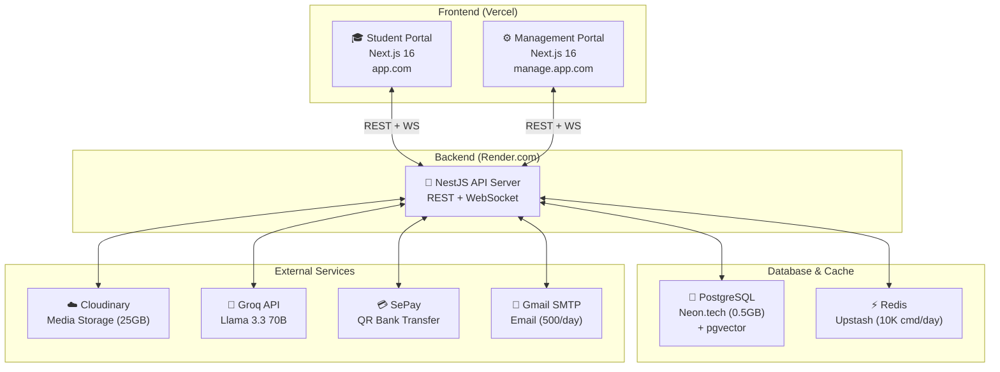
```mermaid
graph TB
    subgraph "Frontend (Vercel)"
        SP["🎓 Student Portal<br/>Next.js 16<br/>app.com"]
        MP["⚙️ Management Portal<br/>Next.js 16<br/>manage.app.com"]
    end

    subgraph "Backend (Render.com)"
        API["🔧 NestJS API Server<br/>REST + WebSocket"]
    end

    subgraph "Database & Cache"
        DB["🐘 PostgreSQL<br/>Neon.tech (0.5GB)<br/>+ pgvector"]
        Redis["⚡ Redis<br/>Upstash (10K cmd/day)"]
    end

    subgraph "External Services"
        Cloud["☁️ Cloudinary<br/>Media Storage (25GB)"]
        Groq["🤖 Groq API<br/>Llama 3.3 70B"]
        SePay["💳 SePay<br/>QR Bank Transfer"]
        Gmail["📧 Gmail SMTP<br/>Email (500/day)"]
    end

    SP <-->|REST + WS| API
    MP <-->|REST + WS| API
    API <--> DB
    API <--> Redis
    API <--> Cloud
    API <--> Groq
    API <--> SePay
    API <--> Gmail
```

**Đặc điểm kiến trúc:**
- **Student Portal** (app.com): Dành cho học viên — browse, mua khóa học, học tập, mạng xã hội, AI Tutor
- **Management Portal** (manage.app.com): Dành cho Instructor và Admin — quản lý khóa học, duyệt, thống kê
- **1 Backend API chung**: NestJS REST API + WebSocket, phân quyền theo role
- **Chi phí hosting: $0/tháng** — Toàn bộ sử dụng free tier

---

## 2. PHÂN TÍCH YÊU CẦU

### 2.1 Tác nhân (Actors)

#### Tác nhân chính (Primary Actors)

| Actor | Portal | Mô tả | Mục tiêu |
|-------|--------|--------|----------|
| **Student** (Học viên) | Student Portal | Người mua và học khóa học | Tìm khóa phù hợp, học tập, tương tác cộng đồng |
| **Instructor** (Giảng viên) | Management Portal | Người tạo và bán khóa học | Quản lý khóa học, theo dõi doanh thu, hỗ trợ học viên |
| **Admin** (Quản trị viên) | Management Portal | Người quản lý nền tảng | Duyệt nội dung, quản lý users, giám sát hệ thống |

> **Lưu ý:** Student có thể nộp đơn upgrade thành Instructor (qua Admin approval).

#### Tác nhân phụ (Secondary Actors)

| Actor | Vai trò | Service |
|-------|---------|---------|
| Payment Gateway | Xử lý thanh toán QR bank transfer | SePay |
| Notification Service | Gửi email transactional | Gmail SMTP |
| Cloud Storage | Lưu trữ video và hình ảnh | Cloudinary |
| AI Service | Chatbot hỗ trợ học tập (RAG) | Groq API (Llama 3.3 70B) |

#### Sơ đồ Actor

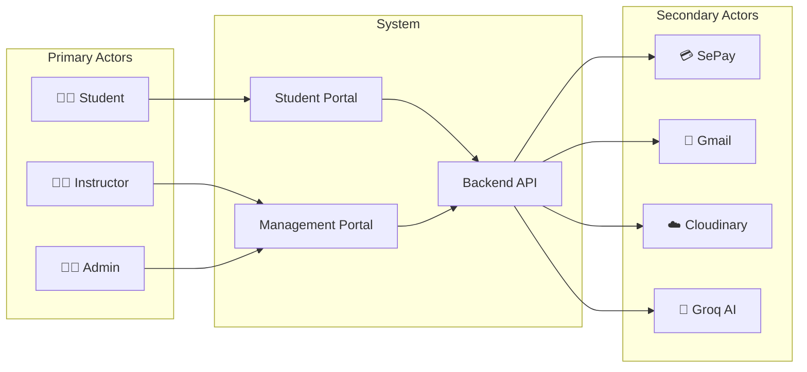
```mermaid
graph LR
    subgraph "Primary Actors"
        S["👨‍🎓 Student"]
        I["👨‍🏫 Instructor"]
        A["👨‍💼 Admin"]
    end

    subgraph "System"
        SP["Student Portal"]
        MP["Management Portal"]
        BE["Backend API"]
    end

    subgraph "Secondary Actors"
        PAY["💳 SePay"]
        MAIL["📧 Gmail"]
        MEDIA["☁️ Cloudinary"]
        AI["🤖 Groq AI"]
    end

    S --> SP
    I --> MP
    A --> MP
    SP --> BE
    MP --> BE
    BE --> PAY
    BE --> MAIL
    BE --> MEDIA
    BE --> AI
```

### 2.2 Biểu đồ Use Case

Hệ thống có tổng cộng **35 Use Cases** được phân nhóm theo 9 module chức năng.

#### Biểu đồ Use Case tổng quan

Biểu đồ dưới đây thể hiện tổng quan các nhóm chức năng theo từng actor:

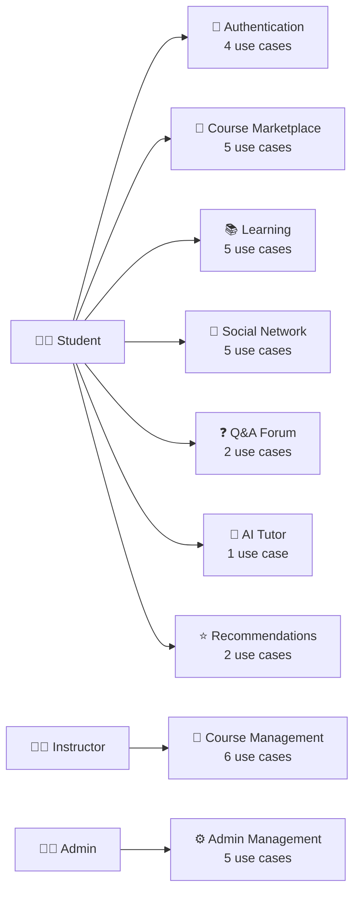
```mermaid
graph LR
    S["👨‍🎓 Student"]
    I["👨‍🏫 Instructor"]
    A["👨‍💼 Admin"]

    S --> AUTH["🔐 Authentication<br/>4 use cases"]
    S --> MARKET["🛒 Course Marketplace<br/>5 use cases"]
    S --> LEARN["📚 Learning<br/>5 use cases"]
    S --> SOCIAL["💬 Social Network<br/>5 use cases"]
    S --> QA["❓ Q&A Forum<br/>2 use cases"]
    S --> AI["🤖 AI Tutor<br/>1 use case"]
    S --> REC["⭐ Recommendations<br/>2 use cases"]

    I --> COURSE["📝 Course Management<br/>6 use cases"]

    A --> ADMIN["⚙️ Admin Management<br/>5 use cases"]
```

#### 2.2.1 Use Case — Authentication & User (Student)

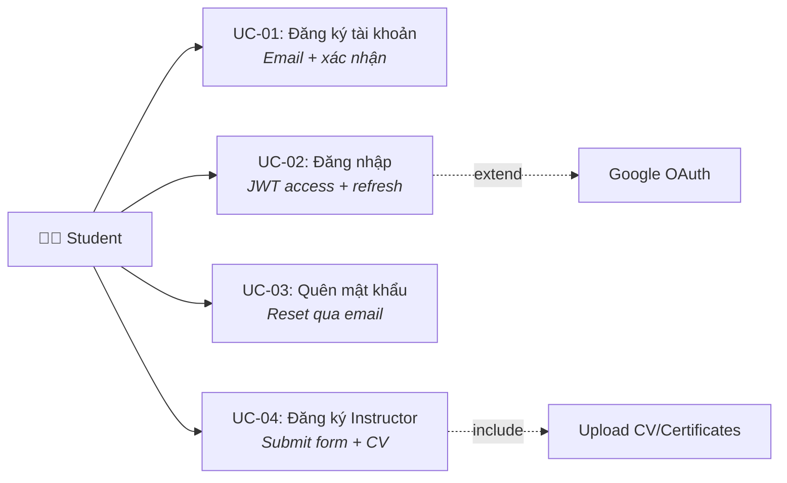
```mermaid
graph LR
    S["👨‍🎓 Student"]

    S --> UC01["UC-01: Đăng ký tài khoản<br/><i>Email + xác nhận</i>"]
    S --> UC02["UC-02: Đăng nhập<br/><i>JWT access + refresh</i>"]
    S --> UC03["UC-03: Quên mật khẩu<br/><i>Reset qua email</i>"]
    S --> UC04["UC-04: Đăng ký Instructor<br/><i>Submit form + CV</i>"]

    UC02 -.->|"extend"| EX1["Google OAuth"]
    UC04 -.->|"include"| INC1["Upload CV/Certificates"]
```

#### 2.2.2 Use Case — Course Marketplace (Student)

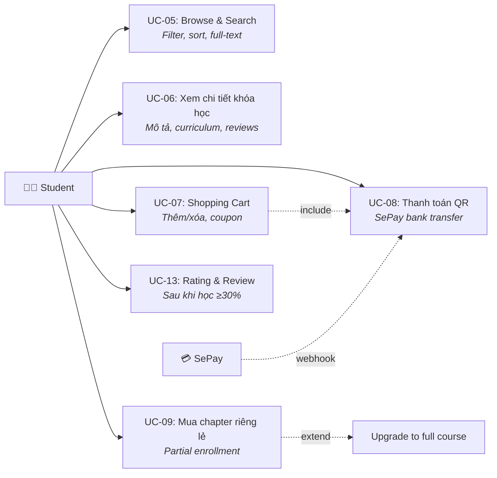
```mermaid
graph LR
    S["👨‍🎓 Student"]

    S --> UC05["UC-05: Browse & Search<br/><i>Filter, sort, full-text</i>"]
    S --> UC06["UC-06: Xem chi tiết khóa học<br/><i>Mô tả, curriculum, reviews</i>"]
    S --> UC07["UC-07: Shopping Cart<br/><i>Thêm/xóa, coupon</i>"]
    S --> UC08["UC-08: Thanh toán QR<br/><i>SePay bank transfer</i>"]
    S --> UC09["UC-09: Mua chapter riêng lẻ<br/><i>Partial enrollment</i>"]
    S --> UC13R["UC-13: Rating & Review<br/><i>Sau khi học ≥30%</i>"]

    UC07 -.->|"include"| UC08
    UC09 -.->|"extend"| EX2["Upgrade to full course"]

    PAY["💳 SePay"] -.->|"webhook"| UC08
```

#### 2.2.3 Use Case — Learning Experience (Student)

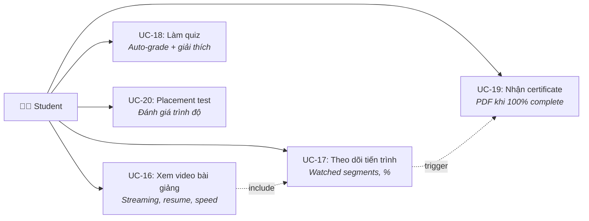
```mermaid
graph LR
    S["👨‍🎓 Student"]

    S --> UC16["UC-16: Xem video bài giảng<br/><i>Streaming, resume, speed</i>"]
    S --> UC17["UC-17: Theo dõi tiến trình<br/><i>Watched segments, %</i>"]
    S --> UC18["UC-18: Làm quiz<br/><i>Auto-grade + giải thích</i>"]
    S --> UC19["UC-19: Nhận certificate<br/><i>PDF khi 100% complete</i>"]
    S --> UC20["UC-20: Placement test<br/><i>Đánh giá trình độ</i>"]

    UC16 -.->|"include"| UC17
    UC17 -.->|"trigger"| UC19
```

#### 2.2.4 Use Case — Social & Communication (Student)

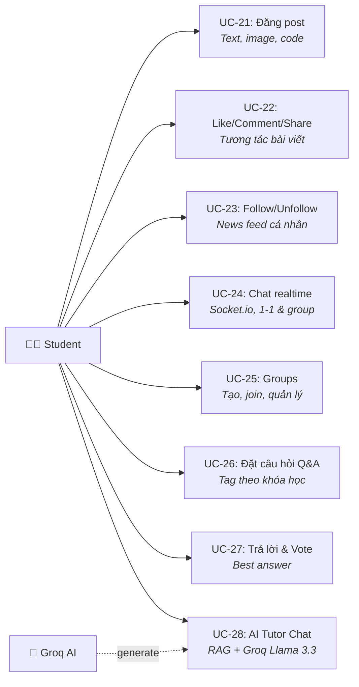
```mermaid
graph LR
    S["👨‍🎓 Student"]

    S --> UC21["UC-21: Đăng post<br/><i>Text, image, code</i>"]
    S --> UC22["UC-22: Like/Comment/Share<br/><i>Tương tác bài viết</i>"]
    S --> UC23["UC-23: Follow/Unfollow<br/><i>News feed cá nhân</i>"]
    S --> UC24["UC-24: Chat realtime<br/><i>Socket.io, 1-1 & group</i>"]
    S --> UC25["UC-25: Groups<br/><i>Tạo, join, quản lý</i>"]
    S --> UC26["UC-26: Đặt câu hỏi Q&A<br/><i>Tag theo khóa học</i>"]
    S --> UC27["UC-27: Trả lời & Vote<br/><i>Best answer</i>"]
    S --> UC28["UC-28: AI Tutor Chat<br/><i>RAG + Groq Llama 3.3</i>"]

    AI["🤖 Groq AI"] -.->|"generate"| UC28
```

#### 2.2.5 Use Case — Course Management (Instructor)

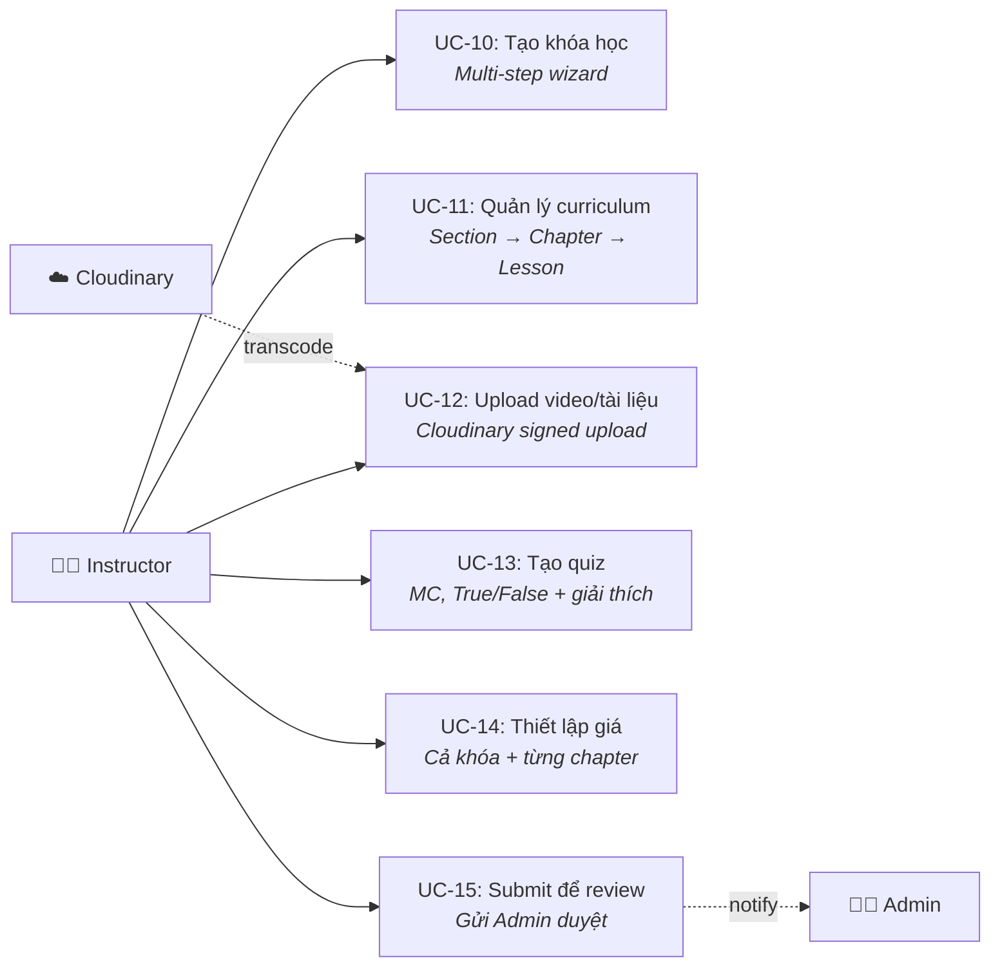
```mermaid
graph LR
    I["👨‍🏫 Instructor"]

    I --> UC10["UC-10: Tạo khóa học<br/><i>Multi-step wizard</i>"]
    I --> UC11["UC-11: Quản lý curriculum<br/><i>Section → Chapter → Lesson</i>"]
    I --> UC12["UC-12: Upload video/tài liệu<br/><i>Cloudinary signed upload</i>"]
    I --> UC13["UC-13: Tạo quiz<br/><i>MC, True/False + giải thích</i>"]
    I --> UC14["UC-14: Thiết lập giá<br/><i>Cả khóa + từng chapter</i>"]
    I --> UC15["UC-15: Submit để review<br/><i>Gửi Admin duyệt</i>"]

    CL["☁️ Cloudinary"] -.->|"transcode"| UC12
    UC15 -.->|"notify"| ADM["👨‍💼 Admin"]
```

#### 2.2.6 Use Case — Admin Management

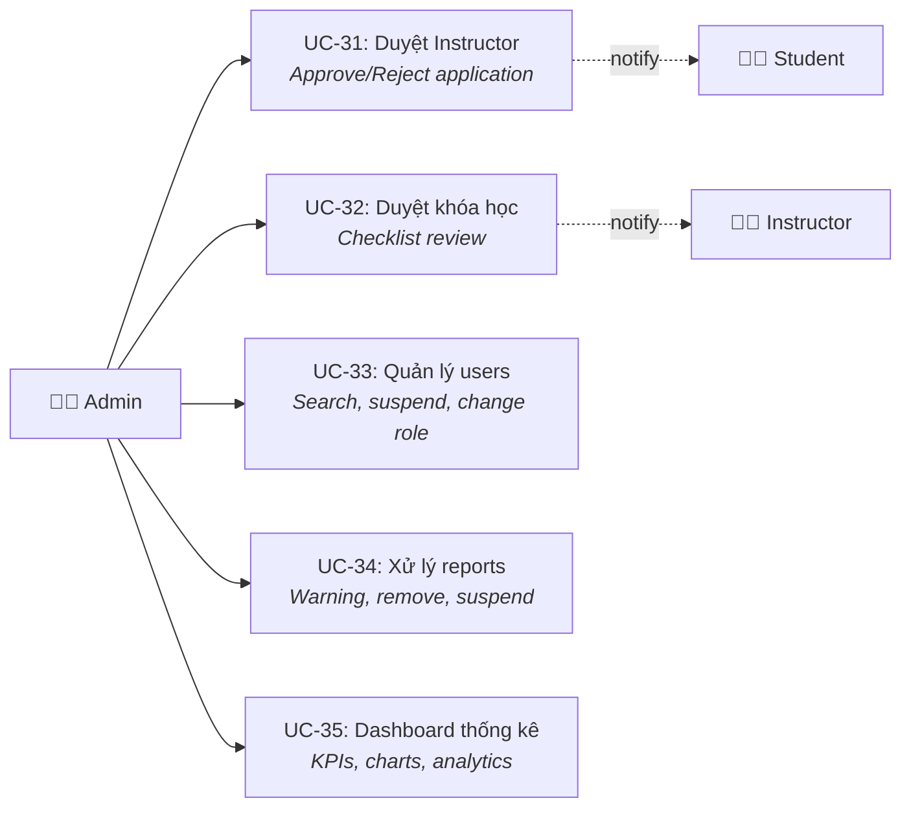
```mermaid
graph LR
    A["👨‍💼 Admin"]

    A --> UC31["UC-31: Duyệt Instructor<br/><i>Approve/Reject application</i>"]
    A --> UC32["UC-32: Duyệt khóa học<br/><i>Checklist review</i>"]
    A --> UC33["UC-33: Quản lý users<br/><i>Search, suspend, change role</i>"]
    A --> UC34["UC-34: Xử lý reports<br/><i>Warning, remove, suspend</i>"]
    A --> UC35["UC-35: Dashboard thống kê<br/><i>KPIs, charts, analytics</i>"]

    UC31 -.->|"notify"| STU["👨‍🎓 Student"]
    UC32 -.->|"notify"| INS["👨‍🏫 Instructor"]
```

### 2.3 Yêu cầu chức năng (Functional Requirements)

Tổng cộng **69 yêu cầu chức năng** được phân loại theo mức ưu tiên MoSCoW:

| Mức ưu tiên | Số lượng | Mô tả |
|-------------|----------|-------|
| **Must Have** | 46 | Core — hệ thống không hoạt động nếu thiếu |
| **Should Have** | 18 | Quan trọng — bổ sung sau MVP |
| **Could Have** | 5 | Nice-to-have |
| **Tổng** | **69** | |

#### FR-1: Authentication & Authorization (9 yêu cầu)

| ID | Yêu cầu | Ưu tiên |
|----|---------|---------|
| FR-1.1 | Đăng ký bằng email + mật khẩu + xác nhận email | Must |
| FR-1.2 | Đăng ký/Đăng nhập bằng Google OAuth | Should |
| FR-1.3 | JWT authentication (access 15m + refresh 7d, rotation) | Must |
| FR-1.4 | Quên mật khẩu → Reset qua email | Must |
| FR-1.5 | Phân quyền role: Student, Instructor, Admin | Must |
| FR-1.6 | Rate limiting login (5 lần/15 phút per IP) | Should |
| FR-1.7 | Đăng ký làm Instructor (submit application form) | Must |
| FR-1.8 | Cross-portal auth (One-Time Token redirect) | Must |
| FR-1.9 | Management Portal guard (chặn Student chưa duyệt) | Must |

#### FR-2: User Profile (4 yêu cầu)

| ID | Yêu cầu | Ưu tiên |
|----|---------|---------|
| FR-2.1 | CRUD profile: avatar (Cloudinary), bio, skills, social links | Must |
| FR-2.2 | Instructor profile: bằng cấp, kinh nghiệm, chuyên môn | Must |
| FR-2.3 | Public profile page (viewable by others) | Must |
| FR-2.4 | Learning profile: skills map, certificates, streak | Should |

#### FR-3: Course Marketplace — Ecommerce (15 yêu cầu)

| ID | Yêu cầu | Ưu tiên |
|----|---------|---------|
| FR-3.1 | Danh sách khóa học + pagination + caching | Must |
| FR-3.2 | Filter: category, price range, rating, level, language | Must |
| FR-3.3 | Sort: popular, newest, highest rated, price | Must |
| FR-3.4 | Full-text search (PostgreSQL tsvector + GIN index) | Must |
| FR-3.5 | Chi tiết khóa: mô tả, curriculum, preview, instructor | Must |
| FR-3.6 | Hiển thị giá cả khóa + giá từng chapter | Must |
| FR-3.7 | Shopping Cart (DB + localStorage merge khi login) | Must |
| FR-3.8 | Checkout + SePay QR bank transfer + webhook | Must |
| FR-3.9 | Mua từng chapter riêng lẻ + upgrade to full course | Must |
| FR-3.10 | Coupon áp dụng khi checkout | Should |
| FR-3.11 | Order history + Invoice | Should |
| FR-3.12 | Wishlist + thông báo giảm giá | Could |
| FR-3.13 | Rating & Review (≥30% progress, incremental avg) | Must |
| FR-3.14 | Gợi ý upgrade full course khi mua lẻ chapters | Should |
| FR-3.15 | Refund trong 7 ngày nếu học < 10% | Should |

#### FR-4: Course Management — Instructor (14 yêu cầu)

| ID | Yêu cầu | Ưu tiên |
|----|---------|---------|
| FR-4.1 | Tạo khóa học wizard (multi-step: info → curriculum → pricing) | Must |
| FR-4.2 | Tạo curriculum: Section → Chapter → Lesson | Must |
| FR-4.3 | Upload video (Cloudinary signed upload, direct từ client) | Must |
| FR-4.4 | Video auto-transcode (Cloudinary eager transforms 480/720p) | Must |
| FR-4.5 | Video status tracking (UPLOADING → READY) | Must |
| FR-4.6 | Tạo text content (rich text editor) | Must |
| FR-4.7 | Upload tài liệu đính kèm (PDF, slides) | Should |
| FR-4.8 | Tạo quiz: multiple choice, true/false + giải thích | Must |
| FR-4.9 | Drag & drop sắp xếp lessons/chapters | Should |
| FR-4.10 | Thiết lập giá: cả khóa + từng chapter | Must |
| FR-4.11 | Quản lý coupon (CRUD, usage tracking) | Should |
| FR-4.12 | Dashboard doanh thu + biểu đồ | Must |
| FR-4.13 | Yêu cầu rút tiền (min threshold, admin approval) | Must |
| FR-4.14 | Submit khóa học để review | Must |

#### FR-5: Learning Experience (11 yêu cầu)

| ID | Yêu cầu | Ưu tiên |
|----|---------|---------|
| FR-5.1 | Course Player: video streaming + sidebar curriculum | Must |
| FR-5.2 | Video player: tốc độ, subtitle, resume position | Should |
| FR-5.3 | Video progress: watched segments tracking (% thực xem) | Must |
| FR-5.4 | Lesson completion logic (80% video/scroll text/quiz pass) | Must |
| FR-5.5 | Course progress = completed / accessible lessons | Must |
| FR-5.6 | Partial enrollment progress (chỉ tính chapters đã mua) | Must |
| FR-5.7 | Làm quiz + chấm điểm tự động + giải thích | Must |
| FR-5.8 | Dashboard tiến trình: courses, streak, time, skills map | Must |
| FR-5.9 | Generate certificate PDF khi 100% complete | Should |
| FR-5.10 | Verify certificate bằng unique ID (public API) | Could |
| FR-5.11 | Placement test (đánh giá trình độ → gợi ý khóa) | Should |

#### FR-6: Social Learning Network (14 yêu cầu)

| ID | Yêu cầu | Ưu tiên |
|----|---------|---------|
| FR-6.1 | News Feed (fanout-on-write, pre-computed) | Must |
| FR-6.2 | Tạo post: text, image, code snippet | Must |
| FR-6.3 | Tương tác: Like, Comment, Share, Bookmark | Must |
| FR-6.4 | Follow/Unfollow + follower count | Must |
| FR-6.5 | Real-time Chat (Socket.io) | Must |
| FR-6.6 | Chat: text, image, code snippet, file sharing | Should |
| FR-6.7 | Typing indicator + read receipts | Could |
| FR-6.8 | Groups: CRUD, join, post, manage members | Must |
| FR-6.9 | Auto-create group cho mỗi khóa học approved | Should |
| FR-6.10 | Q&A Forum: hỏi, trả lời, vote, best answer | Must |
| FR-6.11 | Gợi ý câu hỏi tương tự (full-text search) | Could |
| FR-6.12 | Multi-channel notifications (in-app + email) | Must |
| FR-6.13 | Notification preferences (user configurable) | Should |
| FR-6.14 | Notification aggregation (group similar) | Should |

#### FR-7: Recommendation System (8 yêu cầu)

| ID | Yêu cầu | Ưu tiên |
|----|---------|---------|
| FR-7.1 | Content-Based Filtering (Cosine Similarity on tags) | Must |
| FR-7.2 | Collaborative Filtering (Jaccard Similarity, item-based) | Must |
| FR-7.3 | Popularity ranking (Wilson Score + Time Decay) | Must |
| FR-7.4 | Hybrid weighted scoring (adaptive weights) | Must |
| FR-7.5 | Smart Chapter Suggestion (tag overlap analysis) | Must |
| FR-7.6 | Context-aware display (homepage vs detail vs post-buy) | Should |
| FR-7.7 | Pre-compute similarity matrices (nightly cron) | Should |
| FR-7.8 | Cache recommendations per user (Redis, 1h TTL) | Should |

#### FR-8: AI Features (3 yêu cầu)

| ID | Yêu cầu | Ưu tiên |
|----|---------|---------|
| FR-8.1 | AI Tutor: RAG chat (Groq Llama 3.3 + pgvector) | Must |
| FR-8.2 | AI Tutor: lưu lịch sử chat theo khóa | Should |
| FR-8.3 | Rate limiting AI queries (10/ngày) | Should |

#### FR-9: Admin Management (8 yêu cầu)

| ID | Yêu cầu | Ưu tiên |
|----|---------|---------|
| FR-9.1 | Phê duyệt/Từ chối Instructor applications | Must |
| FR-9.2 | Phê duyệt/Từ chối khóa học (checklist review) | Must |
| FR-9.3 | Quản lý users (view, search, suspend, change role) | Must |
| FR-9.4 | Xử lý reports (dismiss, warning, remove, suspend) | Must |
| FR-9.5 | Dashboard thống kê nền tảng (pre-computed daily) | Must |
| FR-9.6 | Quản lý categories (CRUD) | Must |
| FR-9.7 | Cấu hình hoa hồng (tier-based commission) | Should |
| FR-9.8 | Review & approve withdrawal requests | Must |

### 2.4 Yêu cầu phi chức năng (Non-Functional Requirements)

#### NFR-1: Performance (Hiệu năng)

| ID | Yêu cầu | Metric |
|----|---------|--------|
| NFR-1.1 | Thời gian load trang trung bình | < 2 giây |
| NFR-1.2 | API response time (CRUD) | < 500ms (P95) |
| NFR-1.3 | Search response time | < 1 giây |
| NFR-1.4 | AI Tutor response time | < 5 giây |
| NFR-1.5 | Video streaming start time | < 3 giây |
| NFR-1.6 | Real-time chat delivery | < 200ms |
| NFR-1.7 | Notification delivery | < 1 giây |
| NFR-1.8 | Recommendation generation | < 2 giây |

#### NFR-2: Scalability (Khả năng mở rộng)

| ID | Yêu cầu | Target |
|----|---------|--------|
| NFR-2.1 | Người dùng đồng thời (free tier) | 50-100 concurrent users |
| NFR-2.2 | Tổng số khóa học | 1,000+ courses |
| NFR-2.3 | Video storage (Cloudinary free) | 25GB (~50 videos) |
| NFR-2.4 | Database (Neon free) | 0.5GB, auto-suspend |

#### NFR-3: Security (Bảo mật)

| ID | Yêu cầu | Chi tiết |
|----|---------|---------|
| NFR-3.1 | Mã hóa mật khẩu | bcrypt (salt rounds: 12) |
| NFR-3.2 | Authentication | JWT (access + refresh token) |
| NFR-3.3 | HTTPS/TLS | Bắt buộc cho mọi connection |
| NFR-3.4 | SQL injection protection | Prisma ORM (parameterized queries) |
| NFR-3.5 | XSS protection | Input sanitization + CSP |
| NFR-3.6 | CSRF protection | CSRF tokens |
| NFR-3.7 | Rate limiting | API rate limiting per user |
| NFR-3.8 | File upload validation | Type, size check |
| NFR-3.9 | Video content protection | Cloudinary signed URLs |
| NFR-3.10 | Payment data security | SePay webhook verification |
| NFR-3.11 | CORS configuration | Whitelist allowed origins |

#### NFR-4 → NFR-7

| Nhóm | Nội dung chính |
|------|---------------|
| **NFR-4: Reliability** | Uptime ~99%, database backup (Neon built-in), error logging (Sentry), graceful degradation |
| **NFR-5: Usability** | Responsive design, i18n (vi + en), WCAG 2.1 Level A, skeleton UI, friendly errors |
| **NFR-6: Maintainability** | ESLint + Prettier, Swagger docs, >60% test coverage, Git, CI/CD, modular architecture |
| **NFR-7: Compatibility** | Chrome/Firefox/Safari/Edge, 320px minimum, MP4/WebM video |

### 2.5 Tính năng Won't Have (v1)

- Livestream
- Subscription plan (monthly payment)
- Mobile app (native)
- Multi-language content (i18n cho nội dung khóa)
- Affiliate program

---

## 3. THIẾT KẾ CƠ SỞ DỮ LIỆU

### 3.1 Tổng quan

| Thông số | Giá trị |
|----------|---------|
| Tổng số entities | **61 models** |
| Tổng số enums | **30+** |
| Database engine | PostgreSQL 16 + pgvector |
| ORM | Prisma |
| ID strategy | CUID (collision-resistant, sortable, URL-safe) |
| Storage estimate | ~465MB (trong giới hạn 500MB Neon free) |

### 3.2 Phân nhóm Entities theo Module

| # | Module | Số entities | Entities chính |
|---|--------|-------------|---------------|
| 1 | Auth & Users | 4 | User, InstructorApplication, VerificationToken, PasswordReset |
| 2 | Course Structure | 10 | Course, Section, Chapter, Lesson, Quiz, QuizQuestion, QuizOption, Tag, CourseTag, Review |
| 3 | Ecommerce | 7 | Cart, CartItem, Order, OrderItem, Coupon, CouponCourse, Wishlist |
| 4 | Enrollment & Progress | 5 | Enrollment, ChapterPurchase, LessonProgress, QuizAttempt, QuizAnswer |
| 5 | Social | 6 | Post, Comment, Like, Bookmark, Follow, Share |
| 6 | Groups | 3 | Group, GroupMember, GroupPost |
| 7 | Chat | 3 | Conversation, ConversationMember, Message |
| 8 | Q&A | 4 | Question, Answer, QuestionVote, AnswerVote |
| 9 | Notifications & AI | 5 | Notification, AiTutorSession, AiTutorMessage, CourseEmbedding, DailyActivity |
| 10 | Admin & Finance | 6 | Report, Withdrawal, CommissionTier, PlatformSetting, Certificate, FeedItem |

### 3.3 Các quyết định thiết kế quan trọng

| Quyết định | Chi tiết | Lý do |
|-----------|---------|-------|
| **CUID** cho ID | `@id @default(cuid())` | Collision-resistant, sortable, URL-safe, ngắn hơn UUID |
| **Soft Delete** | `deletedAt DateTime?` cho User, Course, Post | Khôi phục dữ liệu, audit trail |
| **Denormalized Counters** | followerCount, likeCount, avgRating... | Tránh COUNT query tốn tài nguyên |
| **JSON Fields** | notificationPreferences, watchedSegments, bankInfo... | Dữ liệu linh hoạt không cần schema riêng |
| **Composite PKs** | Follow, LessonProgress, DailyActivity... | Junction tables, tránh duplicate |
| **Timestamps** | createdAt + updatedAt cho tất cả entities | Tracking và audit |

### 3.4 ERD — Module 1: Auth & Users

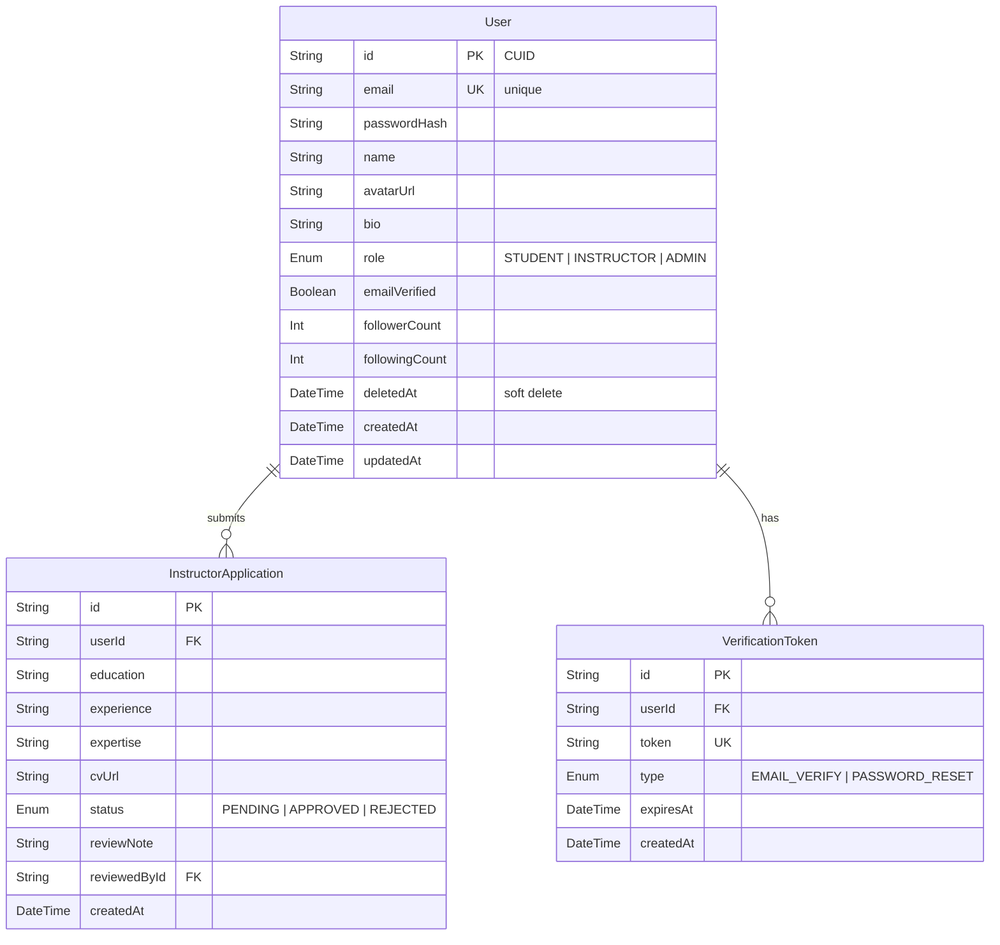
```mermaid
erDiagram
    User {
        String id PK "CUID"
        String email UK "unique"
        String passwordHash
        String name
        String avatarUrl
        String bio
        Enum role "STUDENT | INSTRUCTOR | ADMIN"
        Boolean emailVerified
        Int followerCount
        Int followingCount
        DateTime deletedAt "soft delete"
        DateTime createdAt
        DateTime updatedAt
    }

    InstructorApplication {
        String id PK
        String userId FK
        String education
        String experience
        String expertise
        String cvUrl
        Enum status "PENDING | APPROVED | REJECTED"
        String reviewNote
        String reviewedById FK
        DateTime createdAt
    }

    VerificationToken {
        String id PK
        String userId FK
        String token UK
        Enum type "EMAIL_VERIFY | PASSWORD_RESET"
        DateTime expiresAt
        DateTime createdAt
    }

    User ||--o{ InstructorApplication : "submits"
    User ||--o{ VerificationToken : "has"
```

### 3.5 ERD — Module 2: Course Structure

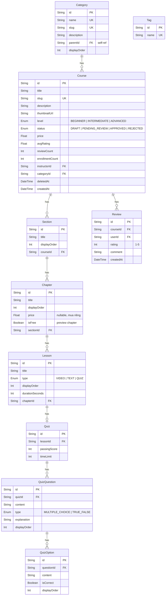
```mermaid
erDiagram
    Course {
        String id PK
        String title
        String slug UK
        String description
        String thumbnailUrl
        Enum level "BEGINNER | INTERMEDIATE | ADVANCED"
        Enum status "DRAFT | PENDING_REVIEW | APPROVED | REJECTED"
        Float price
        Float avgRating
        Int reviewCount
        Int enrollmentCount
        String instructorId FK
        String categoryId FK
        DateTime deletedAt
        DateTime createdAt
    }

    Category {
        String id PK
        String name UK
        String slug UK
        String description
        String parentId FK "self-ref"
        Int displayOrder
    }

    Section {
        String id PK
        String title
        Int displayOrder
        String courseId FK
    }

    Chapter {
        String id PK
        String title
        Int displayOrder
        Float price "nullable, mua riêng"
        Boolean isFree "preview chapter"
        String sectionId FK
    }

    Lesson {
        String id PK
        String title
        Enum type "VIDEO | TEXT | QUIZ"
        Int displayOrder
        Int durationSeconds
        String chapterId FK
    }

    Quiz {
        String id PK
        String lessonId FK
        Int passingScore
        Int timeLimit
    }

    QuizQuestion {
        String id PK
        String quizId FK
        String content
        Enum type "MULTIPLE_CHOICE | TRUE_FALSE"
        String explanation
        Int displayOrder
    }

    QuizOption {
        String id PK
        String questionId FK
        String content
        Boolean isCorrect
        Int displayOrder
    }

    Tag {
        String id PK
        String name UK
    }

    Review {
        String id PK
        String courseId FK
        String userId FK
        Int rating "1-5"
        String comment
        DateTime createdAt
    }

    Course ||--o{ Section : "has"
    Section ||--o{ Chapter : "has"
    Chapter ||--o{ Lesson : "has"
    Lesson ||--o| Quiz : "has"
    Quiz ||--o{ QuizQuestion : "has"
    QuizQuestion ||--o{ QuizOption : "has"
    Course ||--o{ Review : "has"
    Category ||--o{ Course : "has"
```

### 3.6 ERD — Module 3: Ecommerce

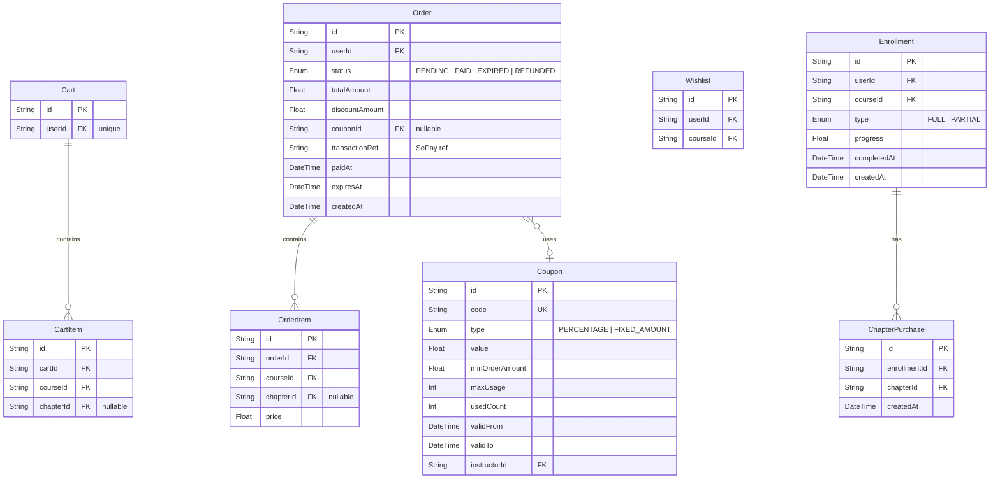
```mermaid
erDiagram
    Cart {
        String id PK
        String userId FK "unique"
    }

    CartItem {
        String id PK
        String cartId FK
        String courseId FK
        String chapterId FK "nullable"
    }

    Order {
        String id PK
        String userId FK
        Enum status "PENDING | PAID | EXPIRED | REFUNDED"
        Float totalAmount
        Float discountAmount
        String couponId FK "nullable"
        String transactionRef "SePay ref"
        DateTime paidAt
        DateTime expiresAt
        DateTime createdAt
    }

    OrderItem {
        String id PK
        String orderId FK
        String courseId FK
        String chapterId FK "nullable"
        Float price
    }

    Coupon {
        String id PK
        String code UK
        Enum type "PERCENTAGE | FIXED_AMOUNT"
        Float value
        Float minOrderAmount
        Int maxUsage
        Int usedCount
        DateTime validFrom
        DateTime validTo
        String instructorId FK
    }

    Wishlist {
        String id PK
        String userId FK
        String courseId FK
    }

    Enrollment {
        String id PK
        String userId FK
        String courseId FK
        Enum type "FULL | PARTIAL"
        Float progress
        DateTime completedAt
        DateTime createdAt
    }

    ChapterPurchase {
        String id PK
        String enrollmentId FK
        String chapterId FK
        DateTime createdAt
    }

    Cart ||--o{ CartItem : "contains"
    Order ||--o{ OrderItem : "contains"
    Order }o--o| Coupon : "uses"
    Enrollment ||--o{ ChapterPurchase : "has"
```

### 3.7 ERD — Module 4-5: Social & Chat

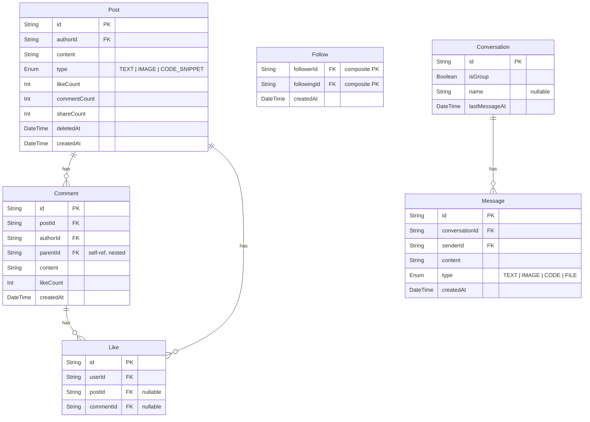
```mermaid
erDiagram
    Post {
        String id PK
        String authorId FK
        String content
        Enum type "TEXT | IMAGE | CODE_SNIPPET"
        Int likeCount
        Int commentCount
        Int shareCount
        DateTime deletedAt
        DateTime createdAt
    }

    Comment {
        String id PK
        String postId FK
        String authorId FK
        String parentId FK "self-ref, nested"
        String content
        Int likeCount
        DateTime createdAt
    }

    Like {
        String id PK
        String userId FK
        String postId FK "nullable"
        String commentId FK "nullable"
    }

    Follow {
        String followerId FK "composite PK"
        String followingId FK "composite PK"
        DateTime createdAt
    }

    Conversation {
        String id PK
        Boolean isGroup
        String name "nullable"
        DateTime lastMessageAt
    }

    Message {
        String id PK
        String conversationId FK
        String senderId FK
        String content
        Enum type "TEXT | IMAGE | CODE | FILE"
        DateTime createdAt
    }

    Post ||--o{ Comment : "has"
    Post ||--o{ Like : "has"
    Comment ||--o{ Like : "has"
    Conversation ||--o{ Message : "has"
```

### 3.8 ERD — Module 6-7: Q&A, AI & Notifications

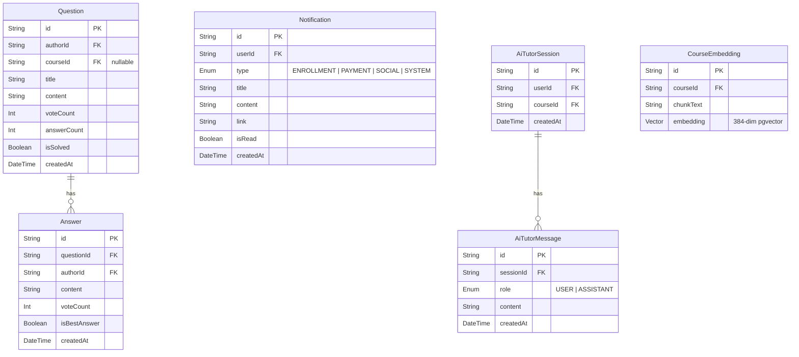
```mermaid
erDiagram
    Question {
        String id PK
        String authorId FK
        String courseId FK "nullable"
        String title
        String content
        Int voteCount
        Int answerCount
        Boolean isSolved
        DateTime createdAt
    }

    Answer {
        String id PK
        String questionId FK
        String authorId FK
        String content
        Int voteCount
        Boolean isBestAnswer
        DateTime createdAt
    }

    Notification {
        String id PK
        String userId FK
        Enum type "ENROLLMENT | PAYMENT | SOCIAL | SYSTEM"
        String title
        String content
        String link
        Boolean isRead
        DateTime createdAt
    }

    AiTutorSession {
        String id PK
        String userId FK
        String courseId FK
        DateTime createdAt
    }

    AiTutorMessage {
        String id PK
        String sessionId FK
        Enum role "USER | ASSISTANT"
        String content
        DateTime createdAt
    }

    CourseEmbedding {
        String id PK
        String courseId FK
        String chunkText
        Vector embedding "384-dim pgvector"
    }

    Question ||--o{ Answer : "has"
    AiTutorSession ||--o{ AiTutorMessage : "has"
```

### 3.9 Index Strategy

| Loại Index | Mục đích | Ví dụ |
|-----------|---------|-------|
| **Primary Key** | ID lookup | `User.id`, `Course.id` |
| **Foreign Key** | JOIN queries | `Course.instructorId`, `Order.userId` |
| **Unique** | Business rules | `User.email`, `Course.slug`, `Coupon.code` |
| **Composite** | Multi-column queries | `(userId, courseId)` cho Enrollment |
| **Full-text (GIN)** | Text search | `Course.title + description` tsvector |
| **Vector (IVFFlat)** | AI similarity search | `CourseEmbedding.embedding` pgvector |

---

## 4. THIẾT KẾ BACKEND ARCHITECTURE

### 4.1 Kiến trúc tầng (Layered Architecture)

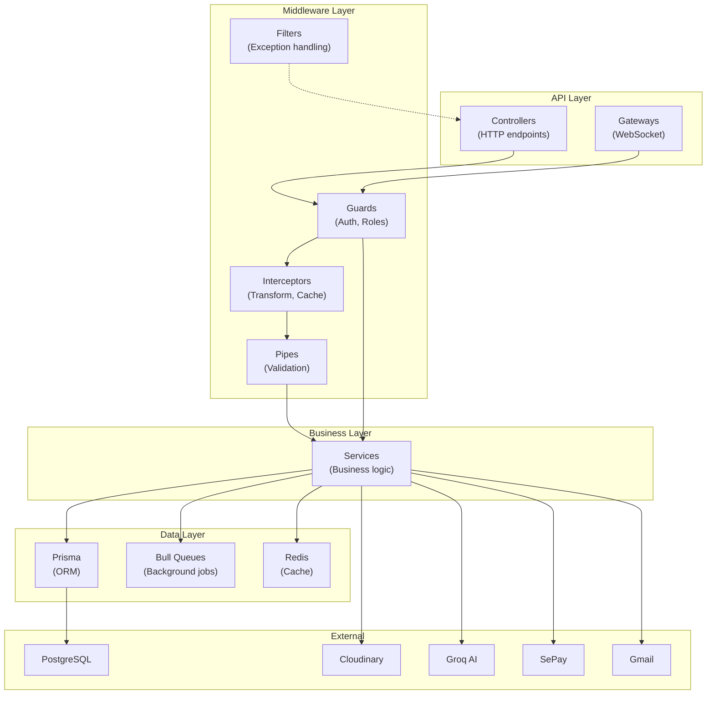
```mermaid
graph TB
    subgraph "API Layer"
        C["Controllers<br/>(HTTP endpoints)"]
        G["Gateways<br/>(WebSocket)"]
    end

    subgraph "Middleware Layer"
        GU["Guards<br/>(Auth, Roles)"]
        INT["Interceptors<br/>(Transform, Cache)"]
        PI["Pipes<br/>(Validation)"]
        FI["Filters<br/>(Exception handling)"]
    end

    subgraph "Business Layer"
        S["Services<br/>(Business logic)"]
    end

    subgraph "Data Layer"
        P["Prisma<br/>(ORM)"]
        Q["Bull Queues<br/>(Background jobs)"]
        R["Redis<br/>(Cache)"]
    end

    subgraph "External"
        DB["PostgreSQL"]
        CL["Cloudinary"]
        GR["Groq AI"]
        SP["SePay"]
        GM["Gmail"]
    end

    C --> GU --> INT --> PI --> S
    G --> GU --> S
    FI -.-> C
    S --> P --> DB
    S --> Q
    S --> R
    S --> CL
    S --> GR
    S --> SP
    S --> GM
```

### 4.2 Danh sách 12 Feature Modules

| # | Module | Endpoints | Mô tả |
|---|--------|-----------|--------|
| 1 | **Auth** | 8 | Register, login, refresh, forgot password, Google OAuth, OTT |
| 2 | **Users** | 7 | Profile CRUD, follow/unfollow, followers/following |
| 3 | **Instructor** | 3 | Applications, dashboard stats |
| 4 | **Courses** | 20+ | Browse, detail, CRUD, curriculum, reviews, quizzes |
| 5 | **Categories** | 5 | CRUD categories (admin) |
| 6 | **Ecommerce** | 7 | Cart, orders, wishlist, payment webhook |
| 7 | **Learning** | 5 | Progress tracking, certificates, placement test |
| 8 | **Social** | 15+ | Posts, comments, likes, follow, feed, groups, chat |
| 9 | **Q&A** | 6 | Questions, answers, voting |
| 10 | **Notifications** | 5 | CRUD, preferences, mark read |
| 11 | **AI Tutor** | 3 | Sessions, chat (streaming), history |
| 12 | **Admin** | 10+ | Users, courses approval, reports, analytics, withdrawals |
| | **Tổng** | **~90** | |

### 4.3 Authentication & Authorization

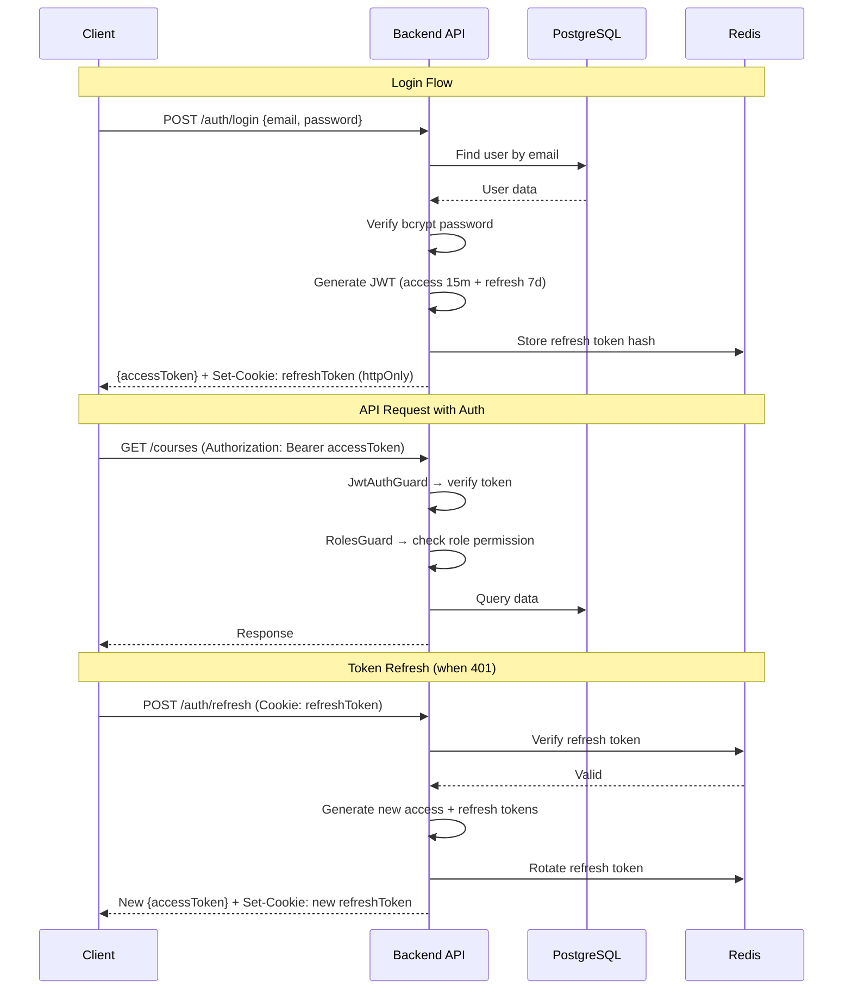
```mermaid
sequenceDiagram
    participant C as Client
    participant API as Backend API
    participant DB as PostgreSQL
    participant R as Redis

    Note over C,R: Login Flow
    C->>API: POST /auth/login {email, password}
    API->>DB: Find user by email
    DB-->>API: User data
    API->>API: Verify bcrypt password
    API->>API: Generate JWT (access 15m + refresh 7d)
    API->>R: Store refresh token hash
    API-->>C: {accessToken} + Set-Cookie: refreshToken (httpOnly)

    Note over C,R: API Request with Auth
    C->>API: GET /courses (Authorization: Bearer accessToken)
    API->>API: JwtAuthGuard → verify token
    API->>API: RolesGuard → check role permission
    API->>DB: Query data
    API-->>C: Response

    Note over C,R: Token Refresh (when 401)
    C->>API: POST /auth/refresh (Cookie: refreshToken)
    API->>R: Verify refresh token
    R-->>API: Valid
    API->>API: Generate new access + refresh tokens
    API->>R: Rotate refresh token
    API-->>C: New {accessToken} + Set-Cookie: new refreshToken
```

### 4.4 Payment Flow (SePay QR Bank Transfer)

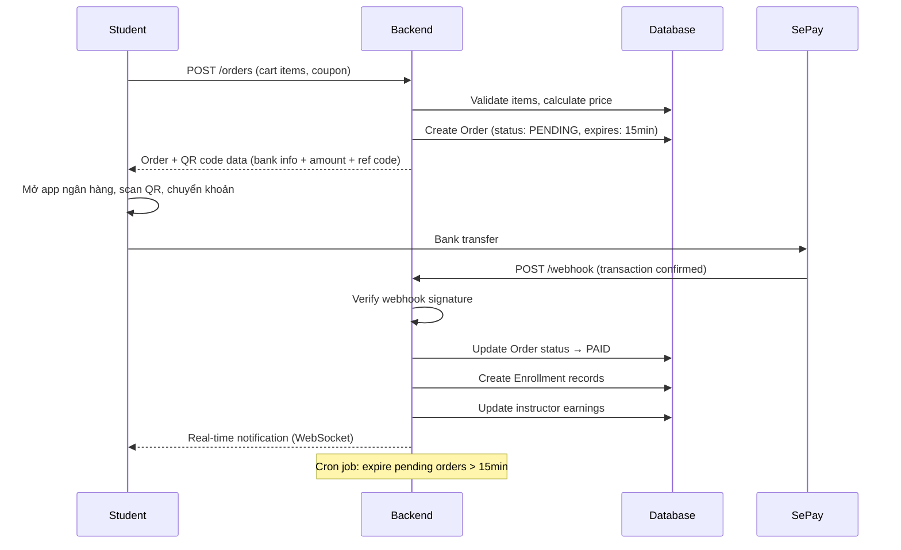
```mermaid
sequenceDiagram
    participant S as Student
    participant API as Backend
    participant DB as Database
    participant SP as SePay

    S->>API: POST /orders (cart items, coupon)
    API->>DB: Validate items, calculate price
    API->>DB: Create Order (status: PENDING, expires: 15min)
    API-->>S: Order + QR code data (bank info + amount + ref code)

    S->>S: Mở app ngân hàng, scan QR, chuyển khoản
    S->>SP: Bank transfer

    SP->>API: POST /webhook (transaction confirmed)
    API->>API: Verify webhook signature
    API->>DB: Update Order status → PAID
    API->>DB: Create Enrollment records
    API->>DB: Update instructor earnings
    API-->>S: Real-time notification (WebSocket)

    Note over API: Cron job: expire pending orders > 15min
```

### 4.5 Realtime & Background Services

| Service | Chi tiết |
|---------|---------|
| **WebSocket — Chat** | Namespace `/chat`, events: send_message, typing, mark_read. JWT auth in handshake |
| **WebSocket — Notifications** | Namespace `/notifications`, push real-time notifications |
| **Bull Queue — Email** | 6 job types: verification, password reset, receipt, approval, withdrawal, welcome |
| **Bull Queue — Notification** | Aggregate + multi-channel delivery (in-app + email) |
| **Bull Queue — Feed** | Fanout-on-write, batch 1000/batch |
| **Cron — Order Expiry** | Mỗi phút, expire pending orders > 15 phút |
| **Cron — Token Cleanup** | Daily 3AM, xóa expired tokens |
| **Cron — Release Earnings** | Daily 1AM, chuyển pending → available earnings |
| **Cron — Analytics** | Daily 2AM, pre-compute platform stats |
| **Cron — Recommendations** | Daily 3AM, tính similarity matrices |

---

## 5. THIẾT KẾ FRONTEND

### 5.1 Design System

| Thành phần | Chi tiết |
|-----------|---------|
| **Color System** | Semantic tokens: primary (navy), secondary, success, warning, destructive. CSS custom properties cho dark/light |
| **Typography** | Inter (headings/body) + JetBrains Mono (code). 8 size scales |
| **Component Library** | 50+ shadcn/ui base components + 60+ custom domain components |
| **Dark/Light Mode** | next-themes, attribute `data-theme`, System default |
| **Responsive** | Mobile-first (Student Portal), Desktop-only ≥1024px (Management Portal) |
| **Icons** | Lucide React — 16px inline, 24px feature, 48px empty state |
| **Animations** | Tailwind transitions (micro), View Transitions (page), Framer Motion (selective) |

### 5.2 Student Portal (~25 pages)

| Nhóm | Pages | Mô tả |
|------|-------|--------|
| **Auth** (5) | Login, Register, Verify Email, Forgot Password, Reset Password | Xác thực người dùng |
| **Browse** (3) | Homepage, Course List, Course Detail | Tìm kiếm và xem khóa học |
| **Ecommerce** (3) | Cart, Checkout, Order History | Mua khóa học |
| **Learning** (4) | My Learning, Course Player, Quiz, Certificates | Học tập |
| **Social** (4) | Feed, Groups, Group Detail, Chat | Mạng xã hội |
| **Q&A** (2) | Forum, Question Detail | Hỏi đáp |
| **AI** (1) | AI Tutor Chat | Chatbot hỗ trợ |
| **Profile** (3) | Public Profile, Edit Profile, Settings | Quản lý cá nhân |

### 5.3 Management Portal (~20 pages)

#### Instructor Pages (10)

| Page | Mô tả |
|------|--------|
| Dashboard | Metrics: revenue, students, enrollments + charts |
| My Courses | Danh sách khóa học + status + actions |
| Create/Edit Course | Multi-step wizard: info → curriculum → pricing → publish |
| Curriculum Editor | Drag-drop sections/chapters/lessons |
| Students List | Danh sách học viên per-course + progress |
| Revenue Dashboard | Earnings, date filter, withdrawal balance |
| Withdrawals | Yêu cầu rút tiền + trạng thái |
| Coupons | CRUD coupons + usage tracking |
| Q&A | Câu hỏi từ học viên + reply |
| Settings | Profile, payment info, notification preferences |

#### Admin Pages (10)

| Page | Mô tả |
|------|--------|
| Dashboard | Platform KPIs: users, courses, revenue, growth charts |
| Users Management | User list, filter by role, edit, ban |
| Instructor Applications | Pending/approved/rejected, review form |
| Course Reviews | Pending courses, approve/reject with reason |
| Categories | CRUD categories, display order |
| Withdrawals | Pending/completed, approval interface |
| Reports | User-submitted reports, actions |
| Analytics | Detailed metrics, date range, export |
| Settings | Platform settings, feature toggles |

---

## 6. TECH STACK & DEPLOYMENT

### 6.1 Bảng Tech Stack đầy đủ

| Layer | Technology | Version | Mục đích |
|-------|-----------|---------|----------|
| **Frontend Framework** | Next.js (App Router) | 16 | SSR/SSG, Turbopack, React Compiler |
| **UI Library** | React | 19.2 | Component-based UI |
| **Language** | TypeScript | 5.x | Type safety (strict mode) |
| **Styling** | Tailwind CSS | 4 | Utility-first CSS |
| **Component Library** | shadcn/ui | latest | Base UI components |
| **i18n** | next-intl | latest | Đa ngôn ngữ (vi + en) |
| **State (Server)** | TanStack Query | 5 | Data fetching & caching |
| **State (Client)** | Zustand | latest | UI state management |
| **Forms** | React Hook Form + Zod | latest | Form handling + validation |
| **Backend Framework** | NestJS | latest | Modular API server |
| **ORM** | Prisma | latest | Type-safe database access |
| **Auth** | Passport.js + JWT | latest | Authentication |
| **WebSocket** | Socket.io | latest | Real-time communication |
| **Queue** | Bull | latest | Background job processing |
| **Database** | PostgreSQL + pgvector | 16 | Relational DB + vector search |
| **Cache** | Redis (Upstash) | latest | Caching & queue backing |
| **Media** | Cloudinary | - | Video/image storage + CDN |
| **AI** | Groq (Llama 3.3 70B) | - | AI Tutor chatbot |
| **Payment** | SePay | - | QR bank transfer |
| **Email** | Gmail SMTP | - | Transactional emails |
| **Monorepo** | Turborepo | latest | Build orchestration |
| **Package Manager** | npm | latest | Dependency management |

### 6.2 External Services & Free Tier Limits

| Service | Mục đích | Free Tier Limit | Đủ cho MVP? |
|---------|---------|----------------|------------|
| **Neon.tech** | PostgreSQL database | 0.5GB storage, auto-suspend | ✅ ~10K users, 1K courses |
| **Upstash** | Redis cache & queue | 10K commands/day | ✅ Optimized ~3-5K/day |
| **Cloudinary** | Video + image storage | 25GB storage, 25GB bandwidth | ✅ ~50 videos, 500 views/month |
| **Groq** | AI Tutor (Llama 3.3 70B) | 30 req/min, 14,400/day | ✅ 10 queries/user/day |
| **Vercel** | Frontend hosting (2 apps) | 100GB bandwidth | ✅ |
| **Render.com** | Backend hosting | 512MB RAM, auto-sleep | ✅ Keep-alive cron |
| **SePay** | Payment gateway | Unlimited | ✅ |
| **Gmail SMTP** | Email | 500 emails/day | ✅ |

**Tổng chi phí: $0/tháng** (100% free tier)

### 6.3 Deployment Architecture

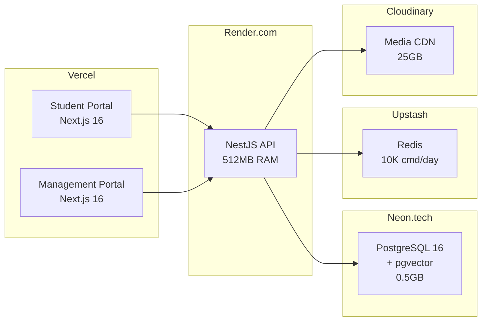
```mermaid
graph LR
    subgraph "Vercel"
        V1["Student Portal<br/>Next.js 16"]
        V2["Management Portal<br/>Next.js 16"]
    end

    subgraph "Render.com"
        R["NestJS API<br/>512MB RAM"]
    end

    subgraph "Neon.tech"
        DB["PostgreSQL 16<br/>+ pgvector<br/>0.5GB"]
    end

    subgraph "Upstash"
        RD["Redis<br/>10K cmd/day"]
    end

    subgraph "Cloudinary"
        CL["Media CDN<br/>25GB"]
    end

    V1 & V2 --> R
    R --> DB
    R --> RD
    R --> CL
```

---

## PHỤ LỤC

### A. Flow: Student → Instructor Upgrade

```
1. Student click "Trở thành giảng viên" trên Student Portal
2. Điền form: education, experience, expertise + upload CV
3. Backend lưu application (status: PENDING)
4. Admin nhận notification trên Management Portal
5. Admin review → Approve/Reject
6. Nếu Approve: role Student → Instructor
7. Student nhận notification "Đã được duyệt"
8. UI hiển thị button "Đi tới Management Portal"
```

### B. Flow: Cross-Portal Authentication

```
1. User đang login trên Student Portal (có access token)
2. Click "Đi tới Management Portal"
3. Frontend gọi GET /auth/ott → nhận One-Time Token
4. Redirect tới manage.app.com?ott=xxx
5. Management Portal gọi POST /auth/exchange-ott
6. Backend verify OTT → trả access + refresh token mới
7. User được đăng nhập trên Management Portal
```

### C. RAG Pipeline cho AI Tutor

```
1. Instructor upload khóa học → Backend chunk nội dung (500 tokens, overlap 50)
2. Embed chunks bằng Transformers.js (384-dim vectors)
3. Lưu embeddings vào PostgreSQL (pgvector)
4. Student hỏi câu hỏi → Embed query → Cosine similarity search
5. Lấy top-K chunks liên quan → Inject vào prompt
6. Gọi Groq API (Llama 3.3 70B) → Stream response về client
```
