# ĐẠI HỌC BÁCH KHOA HÀ NỘI
# TRƯỜNG CÔNG NGHỆ THÔNG TIN VÀ TRUYỀN THÔNG

## BÁO CÁO TUẦN 2: PHÂN TÍCH VÀ THIẾT KẾ HỆ THỐNG

**Đề tài:** Nền tảng mua bán khóa học trực tuyến kết hợp mạng xã hội học tập
(Smart Social Learning Marketplace)

- **Sinh viên:** Nguyễn Việt Anh — MSSV: 20225254
- **Lớp/Khóa:** IT2-02 – K67 (Kỹ thuật Máy tính)
- **GVHD:** TS Nguyễn Thị Thanh Nga

---

<!-- BẮT ĐẦU NỘI DUNG — Copy từ đây vào Word -->

## 1. CHỈNH SỬA SO VỚI TUẦN 1

Sau khi phân tích chi tiết yêu cầu hệ thống, em đã điều chỉnh một số quyết định công nghệ so với báo cáo tuần 1:

| Mục | Tuần 1 (cũ) | Tuần 2 (sửa) | Lý do thay đổi |
|-----|-------------|---------------|-----------------|
| Cơ sở dữ liệu | MongoDB Atlas | PostgreSQL (Neon.tech) | Dữ liệu quan hệ phức tạp (61 entities), cần transaction & JOIN |
| ORM | Mongoose | Prisma | Type-safe, auto migration, tích hợp tốt với NestJS |
| Vector search | MongoDB Atlas Search | pgvector (PostgreSQL extension) | Tích hợp trực tiếp, không cần service riêng cho AI |

---

## 2. KIẾN TRÚC TỔNG THỂ HỆ THỐNG

Hệ thống được thiết kế theo kiến trúc **2 ứng dụng web riêng biệt** chia sẻ chung 1 Backend API:

- **Student Portal** (app.com): Dành cho học viên — tìm kiếm, mua khóa học, học tập, mạng xã hội, AI Tutor
- **Management Portal** (manage.app.com): Dành cho Giảng viên và Quản trị viên — quản lý khóa học, duyệt nội dung, thống kê

<!-- ======================== HÌNH 1 ======================== -->
<!-- Chèn hình: Sơ đồ kiến trúc tổng thể (export từ Mermaid) -->

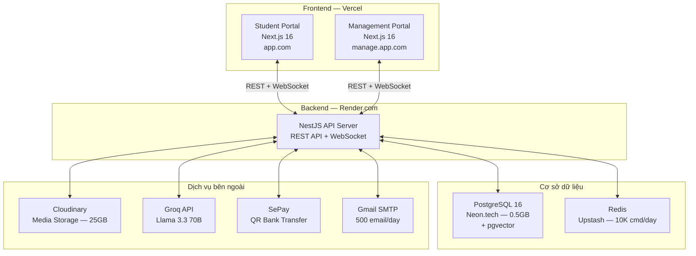

*Hình 2.1: Sơ đồ kiến trúc tổng thể hệ thống*

Toàn bộ hệ thống sử dụng các dịch vụ miễn phí (free tier), tổng chi phí hosting **$0/tháng**, phù hợp với phạm vi đồ án tốt nghiệp.

---

## 3. PHÂN TÍCH YÊU CẦU

### 3.1 Tác nhân hệ thống (Actors)

Hệ thống có 3 tác nhân chính và 4 tác nhân phụ:

**Bảng 3.1: Tác nhân chính**

| Tác nhân | Portal | Mô tả |
|----------|--------|--------|
| **Student** (Học viên) | Student Portal | Người mua và học khóa học, tương tác mạng xã hội |
| **Instructor** (Giảng viên) | Management Portal | Người tạo, quản lý và bán khóa học |
| **Admin** (Quản trị viên) | Management Portal | Người quản lý nền tảng, duyệt nội dung |

> Lưu ý: Student có thể nộp đơn upgrade thành Instructor thông qua quy trình Admin phê duyệt.

**Bảng 3.2: Tác nhân phụ (hệ thống bên ngoài)**

| Tác nhân | Vai trò | Dịch vụ |
|----------|---------|---------|
| Payment Gateway | Xử lý thanh toán QR chuyển khoản | SePay |
| Notification Service | Gửi email xác nhận, thông báo | Gmail SMTP |
| Cloud Storage | Lưu trữ video, hình ảnh | Cloudinary |
| AI Service | Chatbot hỗ trợ học tập (RAG) | Groq API — Llama 3.3 70B |

### 3.2 Biểu đồ Use Case

Hệ thống gồm **35 use cases** được phân thành 9 nhóm chức năng. Dưới đây là biểu đồ tổng quan và chi tiết từng nhóm.

<!-- ======================== HÌNH 2 ======================== -->

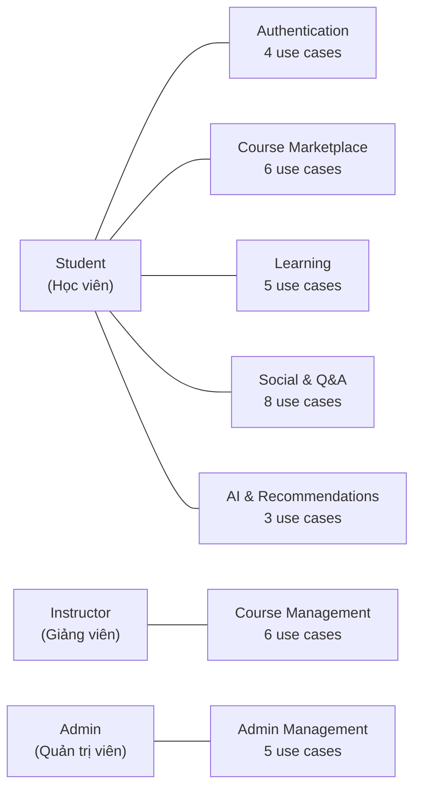

*Hình 3.1: Biểu đồ Use Case tổng quan — phân nhóm theo Actor*

<!-- ======================== HÌNH 3 ======================== -->

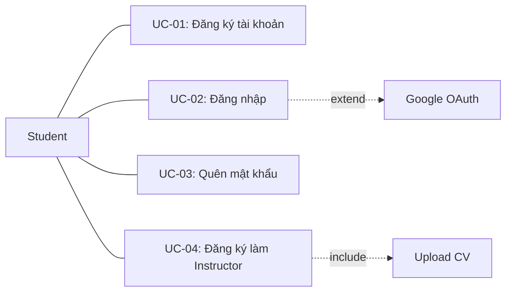

*Hình 3.2: Use Case — Authentication & User Management*

<!-- ======================== HÌNH 4 ======================== -->

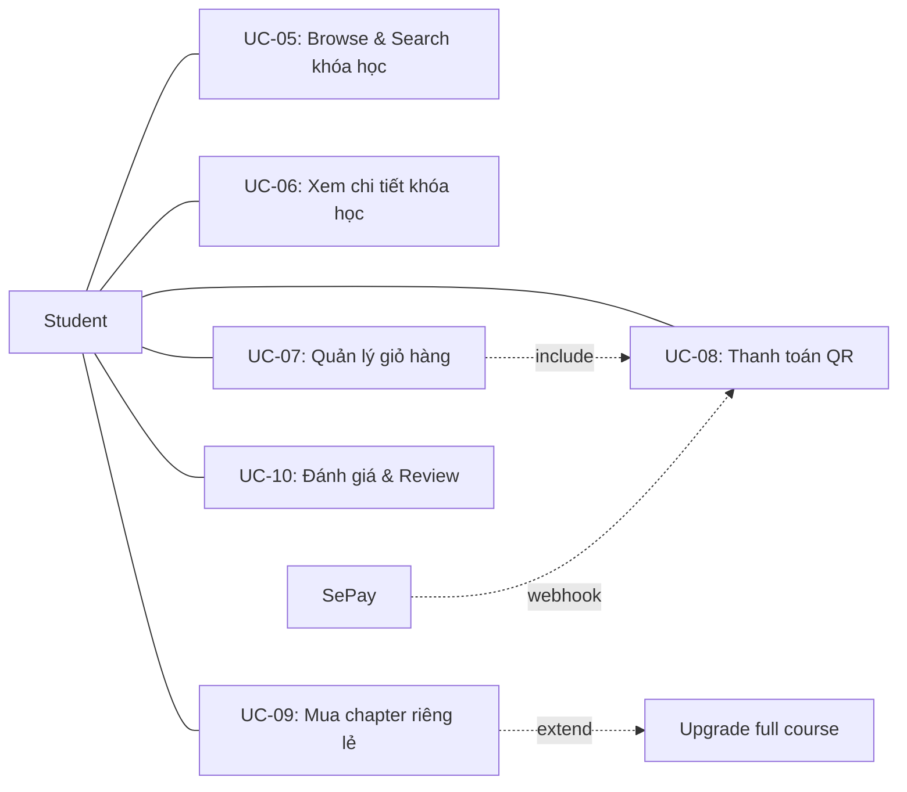

*Hình 3.3: Use Case — Course Marketplace (Ecommerce)*

<!-- ======================== HÌNH 5 ======================== -->

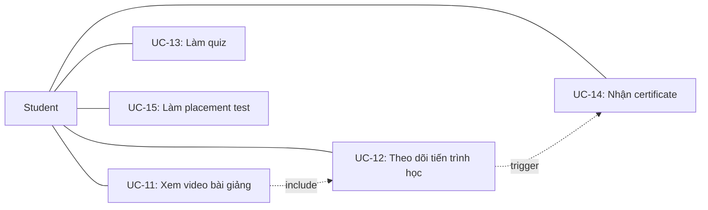

*Hình 3.4: Use Case — Learning Experience*

<!-- ======================== HÌNH 6 ======================== -->

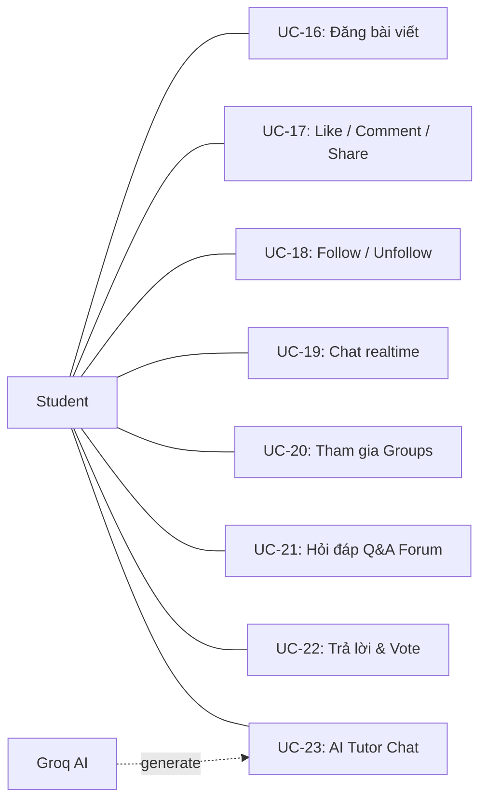

*Hình 3.5: Use Case — Social Network, Q&A & AI*

<!-- ======================== HÌNH 7 ======================== -->

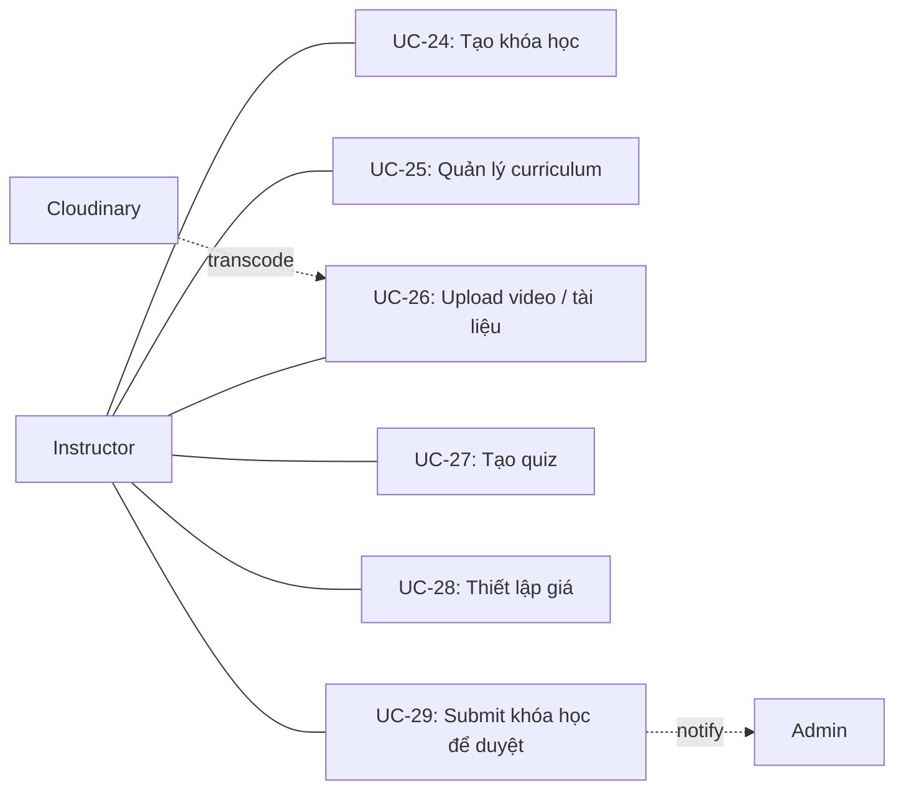

*Hình 3.6: Use Case — Course Management (Instructor)*

<!-- ======================== HÌNH 8 ======================== -->

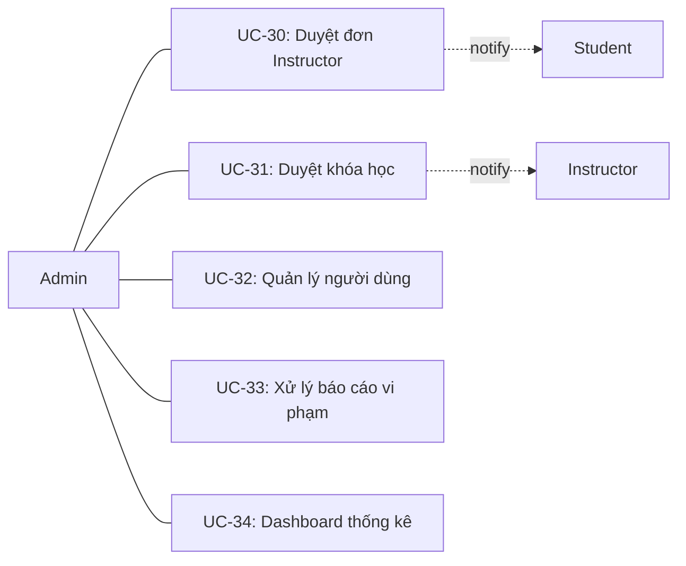

*Hình 3.7: Use Case — Admin Management*

### 3.3 Yêu cầu chức năng

Hệ thống có tổng cộng **69 yêu cầu chức năng**, phân loại theo mức ưu tiên MoSCoW:

**Bảng 3.3: Tổng hợp yêu cầu chức năng theo MoSCoW**

| Mức ưu tiên | Số lượng | Mô tả |
|-------------|----------|-------|
| Must Have | 46 | Chức năng cốt lõi — hệ thống không hoạt động nếu thiếu |
| Should Have | 18 | Quan trọng — bổ sung sau phiên bản MVP |
| Could Have | 5 | Tùy chọn — nếu còn thời gian |
| **Tổng** | **69** | |

**Bảng 3.4: Yêu cầu chức năng phân theo module**

| # | Module | Các chức năng |
|---|--------|---------------|
| FR-1 | Authentication & Authorization | Đăng ký, đăng nhập, JWT, phân quyền, Google OAuth, cross-portal auth |
| FR-2 | User Profile | CRUD profile, public profile, instructor profile, learning profile |
| FR-3 | Course Marketplace | Browse, search, filter, cart, checkout, thanh toán QR, mua chapter riêng lẻ, review |
| FR-4 | Course Management | Tạo khóa học wizard, curriculum, upload video, tạo quiz, thiết lập giá, submit duyệt |
| FR-5 | Learning Experience | Video player, theo dõi tiến trình, làm quiz, certificate, placement test |
| FR-6 | Social Learning Network | News feed, đăng bài, like/comment, follow, chat realtime, groups, Q&A, notifications |
| FR-7 | Recommendation System | Content-based filtering, collaborative filtering, hybrid scoring, gợi ý chapter |
| FR-8 | AI Features | AI Tutor RAG chat (Groq Llama 3.3 + pgvector), lưu lịch sử, rate limiting |
| FR-9 | Admin Management | Duyệt instructor, duyệt khóa học, quản lý users, xử lý reports, dashboard thống kê |

> Chi tiết từng yêu cầu xem tại Phụ lục A.

### 3.4 Yêu cầu phi chức năng

**Bảng 3.5: Yêu cầu phi chức năng**

| Nhóm | Yêu cầu chính | Chỉ số |
|------|---------------|--------|
| **NFR-1: Hiệu năng** | Thời gian load trang | < 2 giây |
| | API response time | < 500ms (P95) |
| | Full-text search | < 1 giây |
| | AI Tutor response | < 5 giây |
| | Chat message delivery | < 200ms |
| **NFR-2: Mở rộng** | Người dùng đồng thời | 50-100 users |
| | Tổng khóa học | 1,000+ |
| | Video storage | 25GB (~50 videos) |
| **NFR-3: Bảo mật** | Mã hóa mật khẩu | bcrypt (salt: 12) |
| | Authentication | JWT access + refresh |
| | Chống tấn công | SQL injection (Prisma), XSS, CSRF, rate limiting |
| **NFR-4: Tin cậy** | Uptime | ~99% |
| | Database backup | Point-in-time (Neon) |
| **NFR-5: Sử dụng** | Responsive | Mobile + Desktop |
| | Đa ngôn ngữ | Tiếng Việt + English |
| | Accessibility | WCAG 2.1 Level A |
| **NFR-6: Bảo trì** | Code quality | ESLint + Prettier |
| | API docs | Swagger/OpenAPI |
| | Test coverage | > 60% business logic |
| **NFR-7: Tương thích** | Browser | Chrome, Firefox, Safari, Edge |
| | Min screen | 320px (mobile) |

---

## 4. THIẾT KẾ CƠ SỞ DỮ LIỆU

### 4.1 Tổng quan

**Bảng 4.1: Thông số cơ sở dữ liệu**

| Thông số | Giá trị |
|----------|---------|
| Database engine | PostgreSQL 16 + pgvector extension |
| ORM | Prisma |
| Tổng số entities (bảng) | 61 |
| Tổng số enums | 30+ |
| ID strategy | CUID (collision-resistant, sortable) |
| Dung lượng ước tính | ~465MB / 500MB free tier |

### 4.2 Phân nhóm Entities

**Bảng 4.2: Danh sách entities theo module**

| # | Module | Số bảng | Các bảng chính |
|---|--------|---------|---------------|
| 1 | Auth & Users | 4 | User, InstructorApplication, VerificationToken, PasswordReset |
| 2 | Course Structure | 10 | Course, Category, Section, Chapter, Lesson, Quiz, QuizQuestion, QuizOption, Tag, Review |
| 3 | Ecommerce | 7 | Cart, CartItem, Order, OrderItem, Coupon, CouponCourse, Wishlist |
| 4 | Enrollment & Progress | 5 | Enrollment, ChapterPurchase, LessonProgress, QuizAttempt, QuizAnswer |
| 5 | Social | 6 | Post, Comment, Like, Bookmark, Follow, Share |
| 6 | Groups | 3 | Group, GroupMember, GroupPost |
| 7 | Chat | 3 | Conversation, ConversationMember, Message |
| 8 | Q&A | 4 | Question, Answer, QuestionVote, AnswerVote |
| 9 | Notifications & AI | 5 | Notification, AiTutorSession, AiTutorMessage, CourseEmbedding, DailyActivity |
| 10 | Admin & Finance | 6 | Report, Withdrawal, CommissionTier, PlatformSetting, Certificate, FeedItem |

### 4.3 Quyết định thiết kế

**Bảng 4.3: Các quyết định thiết kế database**

| Quyết định | Chi tiết | Lý do |
|-----------|---------|-------|
| CUID cho ID | `@default(cuid())` | URL-safe, sortable, không cần auto-increment |
| Soft Delete | `deletedAt` cho User, Course, Post | Cho phép khôi phục, audit trail |
| Denormalized counters | followerCount, likeCount, avgRating | Tránh COUNT query tốn tài nguyên |
| JSON fields | notificationPreferences, watchedSegments | Dữ liệu linh hoạt, không cần bảng riêng |
| Composite PKs | Follow, LessonProgress, DailyActivity | Junction tables, đảm bảo unique |
| Full-text search | tsvector + GIN index | Tìm kiếm khóa học nhanh, built-in PostgreSQL |
| Vector index | pgvector IVFFlat | AI similarity search cho RAG |

### 4.4 ERD — Biểu đồ quan hệ thực thể

#### 4.4.1 ERD — Auth & Users

<!-- ======================== HÌNH 9 ======================== -->

```mermaid
graph TB
    subgraph AUTH["1. Auth & Users"]
        User["User"]
        InstructorApp["InstructorApplication"]
        Token["VerificationToken"]
    end

    subgraph COURSE["2. Course Structure"]
        Course["Course"]
        Category["Category"]
        Section["Section"]
        Chapter["Chapter"]
        Lesson["Lesson"]
        Quiz["Quiz"]
        QuizQuestion["QuizQuestion"]
        Tag["Tag"]
        Review["Review"]
    end

    subgraph ECOM["3. Ecommerce"]
        Cart["Cart"]
        CartItem["CartItem"]
        Order["Order"]
        OrderItem["OrderItem"]
        Coupon["Coupon"]
        Wishlist["Wishlist"]
    end

    subgraph ENROLL["4. Enrollment & Progress"]
        Enrollment["Enrollment"]
        ChapterPurchase["ChapterPurchase"]
        LessonProgress["LessonProgress"]
        QuizAttempt["QuizAttempt"]
    end

    subgraph SOCIAL["5. Social"]
        Post["Post"]
        Comment["Comment"]
        Like["Like"]
        Follow["Follow"]
        Bookmark["Bookmark"]
    end

    subgraph CHAT["6. Groups & Chat"]
        Group["Group"]
        Conversation["Conversation"]
        Message["Message"]
    end

    subgraph QNA["7. Q&A"]
        Question["Question"]
        Answer["Answer"]
    end

    subgraph AITUTOR["8. AI & Notifications"]
        AiTutorSession["AiTutorSession"]
        AiTutorMessage["AiTutorMessage"]
        CourseEmbedding["CourseEmbedding"]
        Notification["Notification"]
    end

    subgraph ADMIN["9. Admin & Finance"]
        Report["Report"]
        Withdrawal["Withdrawal"]
        Certificate["Certificate"]
        FeedItem["FeedItem"]
    end

    %% Cross-module relationships
    User -->|"instructorId"| Course
    User -->|"userId"| Cart
    User -->|"userId"| Order
    User -->|"userId"| Enrollment
    User -->|"authorId"| Post
    User -->|"followerId"| Follow
    User -->|"senderId"| Message
    User -->|"authorId"| Question
    User -->|"userId"| AiTutorSession
    User -->|"userId"| Notification

    Course -->|"courseId"| Section
    Course -->|"courseId"| Review
    Course -->|"courseId"| Enrollment
    Course -->|"courseId"| Question
    Course -->|"courseId"| CourseEmbedding
    Course -->|"courseId"| CartItem
    Course -->|"courseId"| OrderItem
    Course -->|"courseId"| Group

    Order -->|"tạo enrollment"| Enrollment
    Enrollment -->|"enrollmentId"| LessonProgress
    Enrollment -->|"enrollmentId"| Certificate

    Category -->|"categoryId"| Course
```

*Hình 4.1: ERD tổng quan — Liên kết giữa các module (61 entities, 10 modules)*

#### 4.4.1 ERD — Auth & Users

<!-- ======================== HÌNH 10 ======================== -->

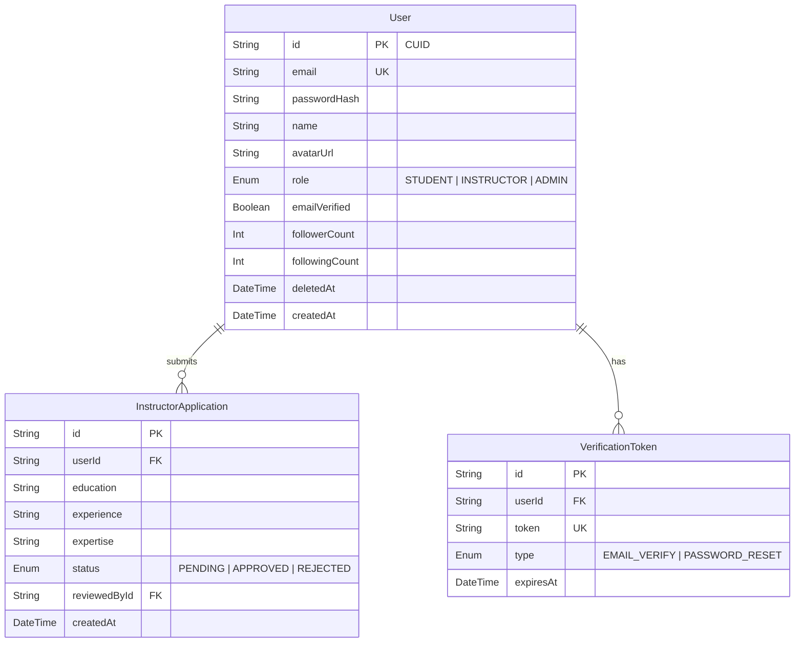

*Hình 4.2: ERD chi tiết — Module Auth & Users*

#### 4.4.2 ERD — Course Structure

<!-- ======================== HÌNH 11 ======================== -->

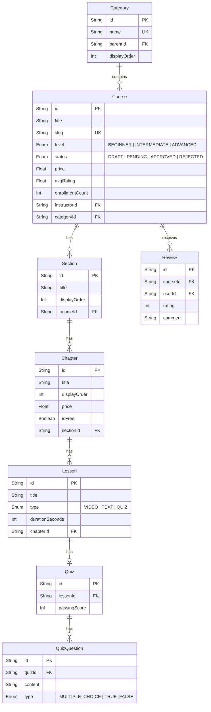

*Hình 4.3: ERD chi tiết — Module Course Structure*

#### 4.4.3 ERD — Ecommerce & Enrollment

<!-- ======================== HÌNH 12 ======================== -->

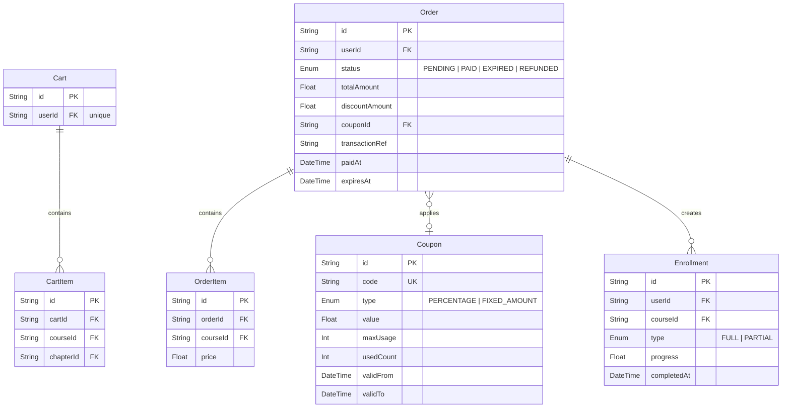

*Hình 4.4: ERD chi tiết — Module Ecommerce & Enrollment*

#### 4.4.4 ERD — Social & Chat

<!-- ======================== HÌNH 13 ======================== -->

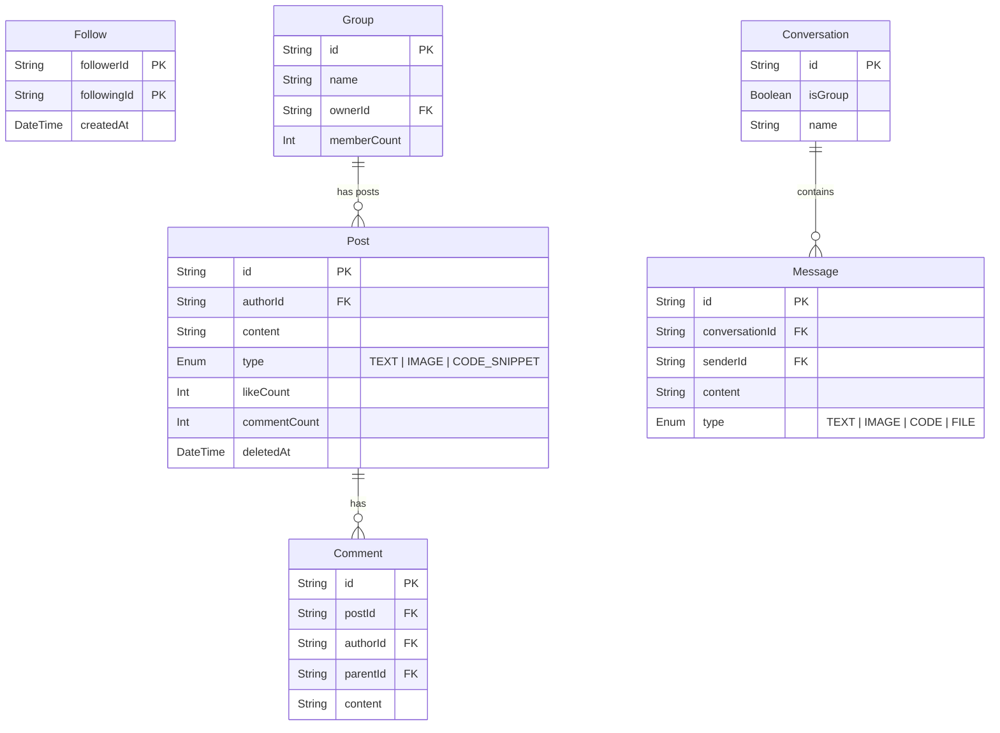

*Hình 4.5: ERD chi tiết — Module Social & Chat*

#### 4.4.5 ERD — Q&A, AI & Notifications

<!-- ======================== HÌNH 14 ======================== -->

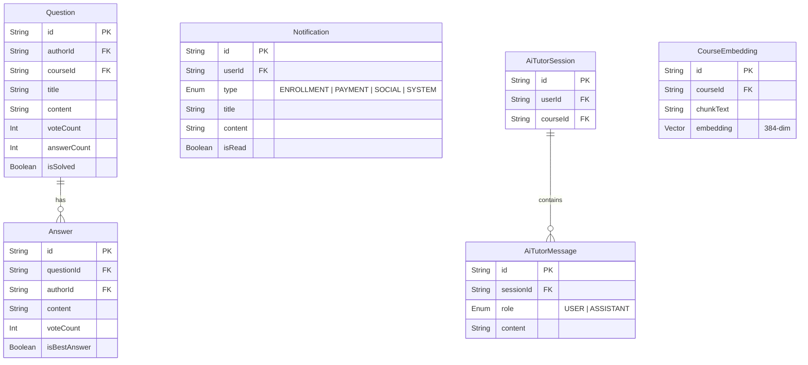

*Hình 4.6: ERD chi tiết — Module Q&A, AI & Notifications*

---

## 5. THIẾT KẾ BACKEND

### 5.1 Kiến trúc Backend

Backend sử dụng **NestJS** với kiến trúc phân tầng (Layered Architecture):

<!-- ======================== HÌNH 15 ======================== -->

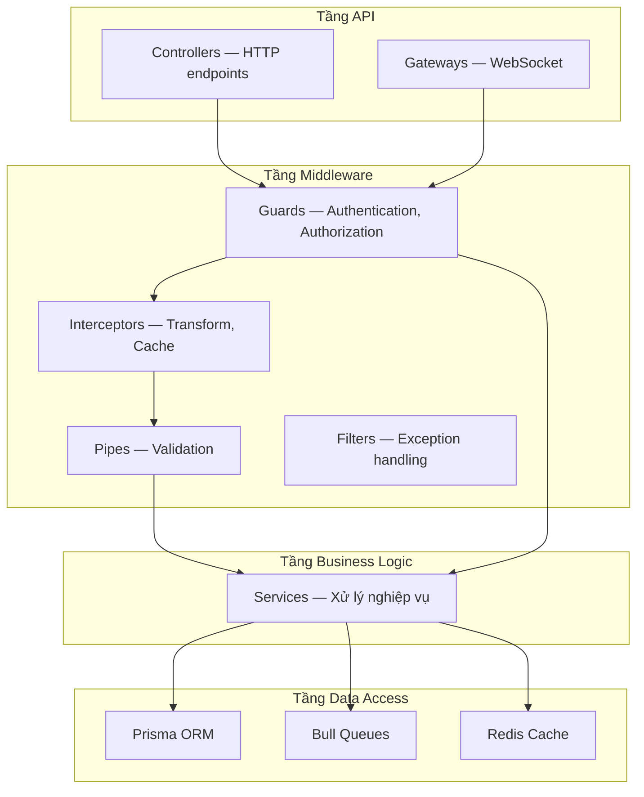

*Hình 5.1: Kiến trúc phân tầng Backend (NestJS)* <!-- Hình 15 -->

### 5.2 Danh sách API Endpoints

**Bảng 5.1: Tổng hợp API endpoints theo module (~90 endpoints)**

| # | Module | Endpoints | Phương thức chính | Mô tả |
|---|--------|-----------|-------------------|-------|
| 1 | Auth | 8 | POST | Đăng ký, đăng nhập, refresh token, quên mật khẩu, OAuth |
| 2 | Users | 7 | GET, PATCH | Profile CRUD, follow/unfollow, danh sách followers |
| 3 | Instructor | 3 | GET, POST | Applications, dashboard statistics |
| 4 | Courses | 20+ | GET, POST, PATCH, DELETE | Browse, CRUD khóa, curriculum, reviews, quizzes |
| 5 | Categories | 5 | GET, POST, PATCH, DELETE | CRUD categories (Admin) |
| 6 | Ecommerce | 7 | GET, POST, DELETE | Cart, orders, wishlist, payment webhook |
| 7 | Learning | 5 | GET, POST, PATCH | Progress, certificates, placement test |
| 8 | Social | 15+ | GET, POST, PATCH, DELETE | Posts, comments, likes, feed, groups, chat |
| 9 | Q&A | 6 | GET, POST, PATCH | Questions, answers, voting |
| 10 | Notifications | 5 | GET, PATCH, DELETE | CRUD, preferences, mark read |
| 11 | AI Tutor | 3 | GET, POST | Sessions, chat (streaming), history |
| 12 | Admin | 10+ | GET, PATCH | Users, approvals, reports, analytics, withdrawals |

### 5.3 Luồng xử lý chính

#### 5.3.1 Luồng Authentication (JWT)

<!-- ======================== HÌNH 16 ======================== -->

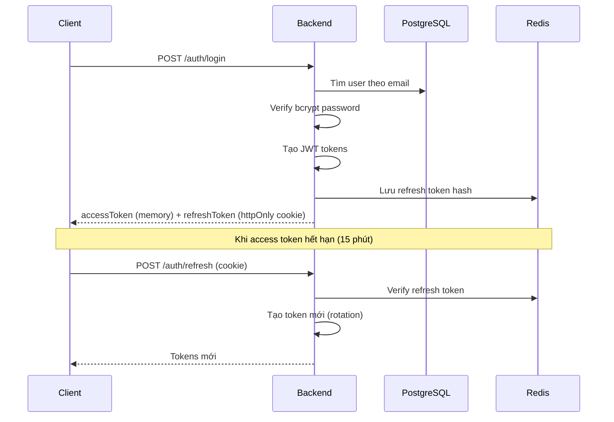

*Hình 5.2: Sequence Diagram — Luồng Authentication*

#### 5.3.2 Luồng Thanh toán (SePay QR)

<!-- ======================== HÌNH 17 ======================== -->

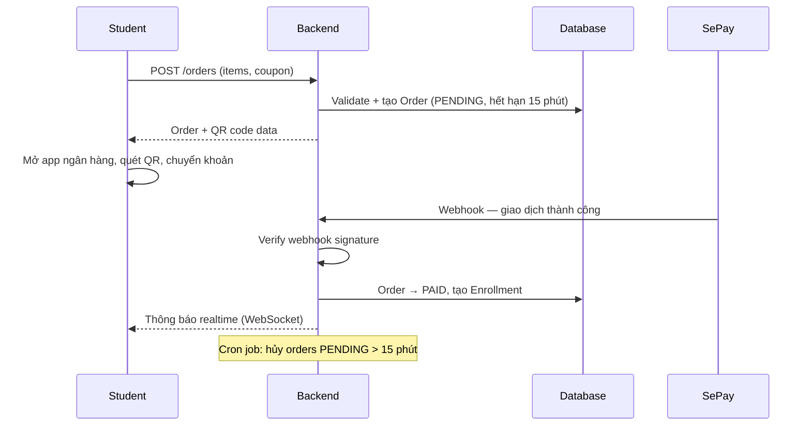

*Hình 5.3: Sequence Diagram — Luồng Thanh toán QR*

### 5.4 Dịch vụ Realtime & Background

**Bảng 5.2: Các dịch vụ nền**

| Loại | Dịch vụ | Chi tiết |
|------|---------|---------|
| **WebSocket** | Chat Gateway | Namespace `/chat` — gửi tin nhắn, typing, đánh dấu đã đọc |
| | Notification Gateway | Namespace `/notifications` — push thông báo realtime |
| **Queue** | Email Queue | Xác nhận email, reset password, receipt, thông báo duyệt |
| | Notification Queue | Aggregate + gửi đa kênh (in-app + email) |
| | Feed Queue | Fanout-on-write cho news feed (batch 1000) |
| **Cron** | Order Expiry | Mỗi phút — hủy đơn PENDING quá 15 phút |
| | Token Cleanup | Daily 3AM — xóa token hết hạn |
| | Analytics | Daily 2AM — pre-compute thống kê |
| | Recommendations | Daily 3AM — tính toán ma trận tương đồng |

---

## 6. THIẾT KẾ FRONTEND

### 6.1 Design System

**Bảng 6.1: Thông số Design System**

| Thành phần | Chi tiết |
|-----------|---------|
| Color System | Semantic tokens (primary, secondary, success, warning, destructive) — hỗ trợ Dark/Light mode |
| Typography | Inter (headings, body) + JetBrains Mono (code) — 8 size scales |
| Component Library | 50+ shadcn/ui base + 60+ custom domain components |
| Theme | Dark / Light / System — next-themes library |
| Responsive | Student Portal: mobile-first; Management Portal: desktop-only (≥1024px) |
| Icons | Lucide React |
| i18n | Tiếng Việt (mặc định) + English — next-intl library |

### 6.2 Student Portal — Danh sách trang (~25 trang)

**Bảng 6.2: Các trang Student Portal**

| Nhóm | Trang | Mô tả |
|------|-------|--------|
| **Auth** | Login, Register, Verify Email, Forgot Password, Reset Password | Xác thực người dùng |
| **Browse** | Homepage, Course List (filter/search), Course Detail | Tìm kiếm khóa học |
| **Ecommerce** | Cart, Checkout (QR), Order History | Mua khóa học |
| **Learning** | My Learning Dashboard, Course Player, Quiz Player, Certificates | Học tập |
| **Social** | News Feed, Groups, Group Detail, Chat | Mạng xã hội |
| **Q&A** | Forum List, Question Detail | Hỏi đáp |
| **AI** | AI Tutor Chat | Chatbot hỗ trợ học tập |
| **Profile** | Public Profile, Edit Profile, Settings | Quản lý cá nhân |

### 6.3 Management Portal — Danh sách trang (~20 trang)

**Bảng 6.3: Các trang Management Portal — Instructor**

| Trang | Mô tả |
|-------|--------|
| Dashboard | Metrics: doanh thu, học viên, enrollments + biểu đồ |
| My Courses | Danh sách khóa học + trạng thái + actions |
| Create/Edit Course | Wizard multi-step: thông tin → curriculum → giá → publish |
| Curriculum Editor | Drag-drop sections / chapters / lessons |
| Students List | Danh sách học viên per-course + tiến trình |
| Revenue | Earnings, date filter, withdrawal balance |
| Coupons | CRUD mã giảm giá + tracking |
| Q&A | Câu hỏi từ học viên + reply |

**Bảng 6.4: Các trang Management Portal — Admin**

| Trang | Mô tả |
|-------|--------|
| Dashboard | Platform KPIs: users, courses, revenue, growth charts |
| Users | Danh sách user, filter by role, edit, ban |
| Instructor Applications | Pending / approved / rejected, review form |
| Course Reviews | Pending courses, approve / reject |
| Categories | CRUD danh mục, display order |
| Withdrawals | Pending / completed, approval interface |
| Reports | User-submitted reports, actions |

---

## 7. CÔNG NGHỆ VÀ TRIỂN KHAI

### 7.1 Tech Stack

**Bảng 7.1: Bảng tổng hợp công nghệ**

| Tầng | Công nghệ | Mục đích |
|------|-----------|----------|
| **Frontend** | Next.js 16 (App Router) + React 19 | Framework SSR/SSG |
| | TypeScript 5 (strict mode) | Type safety |
| | Tailwind CSS 4 + shadcn/ui | Styling + Component library |
| | TanStack Query 5 | Server state management |
| | Zustand | Client state (UI only) |
| | next-intl | Đa ngôn ngữ (vi + en) |
| | Socket.io-client | WebSocket realtime |
| **Backend** | NestJS + TypeScript | REST API framework |
| | Prisma | ORM (type-safe) |
| | Passport.js + JWT | Authentication |
| | Socket.io | WebSocket gateway |
| | Bull + Redis | Job queue |
| | class-validator | DTO validation |
| **Database** | PostgreSQL 16 | Relational database |
| | pgvector | Vector search cho AI |
| | Redis (Upstash) | Cache + queue backing |
| **AI** | Groq API (Llama 3.3 70B) | AI Tutor chatbot |
| | Transformers.js | Local text embeddings (384-dim) |
| **DevOps** | Turborepo | Monorepo orchestration |
| | npm | Package manager |
| | ESLint + Prettier | Code quality |
| | Docker | Local dev (PostgreSQL + Redis) |

### 7.2 Dịch vụ hosting & chi phí

**Bảng 7.2: External services — Free tier**

| Dịch vụ | Mục đích | Giới hạn Free Tier | Đánh giá |
|---------|---------|-------------------|----------|
| Neon.tech | PostgreSQL database | 0.5GB storage | Đủ cho ~10K users, 1K courses |
| Upstash | Redis cache & queue | 10K commands/day | Đủ dùng, tối ưu ~3-5K/day |
| Cloudinary | Video + image storage | 25GB storage, 25GB bandwidth | Đủ cho ~50 videos demo |
| Groq | AI Tutor (Llama 3.3) | 30 req/min, 14,400/day | Đủ cho 10 queries/user/day |
| Vercel | Frontend hosting | 100GB bandwidth | Đủ cho 2 portals |
| Render.com | Backend hosting | 512MB RAM, auto-sleep | Đủ dùng, cần keep-alive cron |
| SePay | Payment gateway | Không giới hạn | Phù hợp |
| Gmail SMTP | Email transactional | 500 email/day | Đủ cho đồ án |

**Tổng chi phí: $0/tháng** — Phù hợp phạm vi đồ án tốt nghiệp.

<!-- ======================== HÌNH 18 ======================== -->

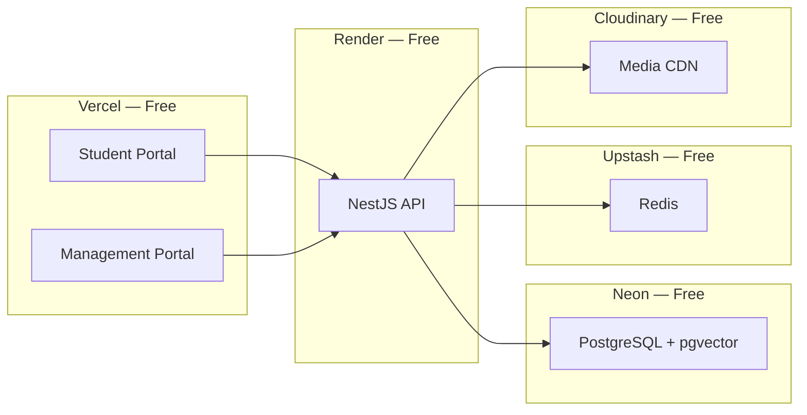

*Hình 7.1: Sơ đồ triển khai hệ thống*

---

## 8. KẾ HOẠCH TUẦN TIẾP THEO

- Tiếp tục implement frontend Student Portal (browse, course detail, learning player)
- Implement frontend Management Portal (instructor dashboard, course management)
- Viết unit tests cho các module backend quan trọng

---

<!-- KẾT THÚC NỘI DUNG BÁO CÁO -->

## PHỤ LỤC A: CHI TIẾT YÊU CẦU CHỨC NĂNG

*(Xem file đầy đủ tại: docs/reports/week2-analysis-design.md)*
