# ĐẠI HỌC BÁCH KHOA HÀ NỘI
# TRƯỜNG CÔNG NGHỆ THÔNG TIN VÀ TRUYỀN THÔNG

## BÁO CÁO TUẦN 3: THIẾT LẬP DỰ ÁN VÀ TRIỂN KHAI BACKEND CỐT LÕI

**Đề tài:** Nền tảng mua bán khóa học trực tuyến kết hợp mạng xã hội học tập
(Smart Social Learning Marketplace)

- **Sinh viên:** Nguyễn Việt Anh — MSSV: 20225254
- **Lớp/Khóa:** IT2-02 – K67 (Kỹ thuật Máy tính)
- **GVHD:** TS Nguyễn Thị Thanh Nga

---

<!-- BẮT ĐẦU NỘI DUNG — Copy từ đây vào Word -->

## 1. TỔNG QUAN CÔNG VIỆC TUẦN 3

Tuần này em thực hiện thiết lập toàn bộ hạ tầng dự án và triển khai 4 module backend cốt lõi đầu tiên, dựa trên thiết kế đã hoàn thành ở tuần 2.

**Bảng 1.1: Tổng hợp công việc tuần 3**

| Hạng mục | Nội dung | Kết quả |
|----------|---------|---------|
| Thiết lập Monorepo | Turborepo + npm workspaces, 3 apps + 6 packages | Hoàn thành |
| Docker | PostgreSQL 16 (pgvector) + Redis 7 + pgAdmin | Hoàn thành |
| Code Quality | ESLint, Prettier, Husky, lint-staged, commitlint | Hoàn thành |
| NestJS Backend | Framework setup, global guards/filters/interceptors | Hoàn thành |
| Prisma Schema | 61 models, 30+ enums, migration thành công | Hoàn thành |
| Module Auth | JWT, refresh token rotation, email verification, OTT | Hoàn thành |
| Module Users & Instructor | Profile, follow system, instructor application | Hoàn thành |
| Module Courses & Categories | Browse, management, curriculum CRUD, reviews | Hoàn thành |

---

## 2. THIẾT LẬP DỰ ÁN

### 2.1 Khởi tạo Monorepo

Dự án sử dụng kiến trúc **Monorepo** được quản lý bởi **Turborepo** và **npm workspaces**, cho phép chia sẻ code giữa các ứng dụng và quản lý dependencies tập trung.

**Bảng 2.1: Cấu trúc Monorepo**

| Thư mục | Mô tả | Công nghệ |
|---------|--------|-----------|
| `apps/api` | Backend API server | NestJS + Prisma |
| `apps/student-portal` | Ứng dụng web cho học viên | Next.js 16 |
| `apps/management-portal` | Ứng dụng web cho giảng viên & admin | Next.js 16 |
| `packages/shared-types` | TypeScript types/interfaces dùng chung | TypeScript |
| `packages/shared-ui` | Shared React components (shadcn/ui) | React + Tailwind |
| `packages/shared-utils` | Hàm tiện ích dùng chung | TypeScript |
| `packages/shared-hooks` | Shared React hooks | React |
| `packages/shared-i18n` | Cấu hình i18n dùng chung | next-intl |
| `packages/shared-api-client` | API client + TanStack Query hooks | TanStack Query |

Cấu hình workspaces trong `package.json` root:

```json
{
  "workspaces": ["apps/*", "packages/*"],
  "scripts": {
    "dev": "turbo dev",
    "build": "turbo build",
    "lint": "turbo lint",
    "db:dev": "docker compose up -d",
    "db:stop": "docker compose down"
  }
}
```

**Turborepo** được cấu hình để orchestrate các task như `dev`, `build`, `lint`, `test` với dependency graph tự động — ví dụ `build` sẽ chạy `^build` (build dependencies trước).

### 2.2 Docker — Môi trường phát triển local

Để đảm bảo môi trường phát triển nhất quán, em sử dụng **Docker Compose** với 3 services:

**Bảng 2.2: Docker services**

| Service | Image | Port | Mục đích |
|---------|-------|------|----------|
| `sslm-postgres` | `pgvector/pgvector:pg16` | 5432 | PostgreSQL 16 + pgvector extension |
| `sslm-redis` | `redis:7-alpine` | 6379 | Redis cho cache và job queue |
| `sslm-pgadmin` | `dpage/pgadmin4` | 5050 | Giao diện quản lý database |

Đặc điểm cấu hình:
- Sử dụng image `pgvector/pgvector:pg16` thay vì `postgres:16` thông thường để tích hợp sẵn extension **pgvector** cho tính năng AI similarity search
- **Health check** cho cả PostgreSQL và Redis đảm bảo service sẵn sàng trước khi ứng dụng kết nối
- **Persistent volumes** (`pgdata`, `redisdata`) giữ data khi restart containers
- Khởi động bằng lệnh `npm run db:dev` (alias cho `docker compose up -d`)

### 2.3 Cấu hình Code Quality

**Bảng 2.3: Công cụ đảm bảo chất lượng code**

| Công cụ | Mục đích | Cách hoạt động |
|---------|---------|----------------|
| **ESLint** | Phát hiện lỗi logic, coding conventions | Chạy khi save file + pre-commit |
| **Prettier** | Format code nhất quán | Chạy khi save file + pre-commit |
| **Husky** | Git hooks automation | Trigger lint-staged trước mỗi commit |
| **lint-staged** | Chỉ lint/format file đã thay đổi | Chạy ESLint + Prettier trên staged files |
| **commitlint** | Validate commit message | Đảm bảo Conventional Commits format |

Cấu hình lint-staged chỉ xử lý file đã staged, tránh chạy toàn bộ codebase:

```json
{
  "lint-staged": {
    "*.{ts,tsx}": ["eslint --fix", "prettier --write"],
    "*.{json,css,md,yml,yaml}": ["prettier --write"]
  }
}
```

Commit message phải tuân thủ format **Conventional Commits**: `type(scope): description` — ví dụ `feat(api): add auth module with jwt authentication`.

---

## 3. BACKEND — NESTJS FRAMEWORK

### 3.1 Cấu trúc dự án API

Backend được xây dựng trên **NestJS** — framework Node.js dựa trên kiến trúc modular, sử dụng Dependency Injection và decorator pattern.

```
apps/api/src/
├── main.ts                  # Bootstrap & global config
├── app.module.ts            # Root module — đăng ký tất cả modules
├── config/                  # Config modules (auth, redis, mail, app)
├── prisma/                  # Prisma ORM (schema, migrations, service)
├── redis/                   # Redis service wrapper
├── mail/                    # Nodemailer service (Gmail SMTP)
├── uploads/                 # File upload controller
├── health/                  # Health check endpoint
├── common/
│   ├── guards/              # JwtAuthGuard, RolesGuard
│   ├── filters/             # HttpExceptionFilter, PrismaExceptionFilter
│   ├── interceptors/        # Transform, Logging, Timeout
│   ├── decorators/          # @CurrentUser, @Roles, @Public
│   ├── pipes/               # ParseCuidPipe
│   ├── dto/                 # PaginationDto (base)
│   └── utils/               # pagination.util
└── modules/                 # Feature modules (auth, users, courses, ...)
```

### 3.2 Bootstrap — main.ts

File `main.ts` cấu hình các middleware và plugin global cho NestJS:

<!-- ======================== HÌNH 1 ======================== -->

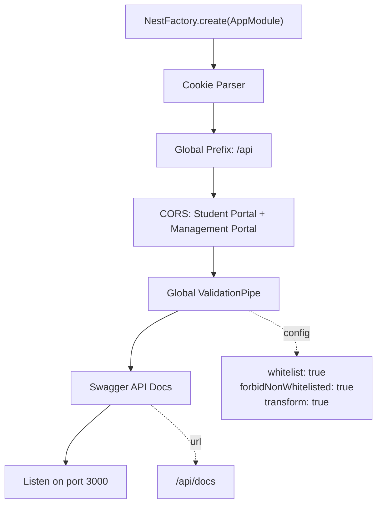

*Hình 3.1: Luồng khởi tạo NestJS Application*

Các cấu hình quan trọng:

| Cấu hình | Giá trị | Mục đích |
|----------|---------|----------|
| Cookie Parser | `cookie-parser` | Parse httpOnly cookie chứa refresh token |
| Global Prefix | `/api` | Tất cả endpoint bắt đầu bằng `/api/...` |
| CORS origins | `localhost:3001`, `localhost:3002` | Cho phép 2 portal gọi API |
| ValidationPipe | `whitelist: true, forbidNonWhitelisted: true` | Tự động validate DTO, loại bỏ field lạ |
| Swagger | `/api/docs` | Tài liệu API tự động từ decorators |

### 3.3 Global Guards, Filters, Interceptors

NestJS cung cấp cơ chế **request pipeline** cho phép xử lý cross-cutting concerns:

<!-- ======================== HÌNH 2 ======================== -->

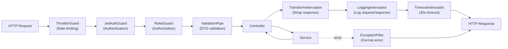

*Hình 3.2: NestJS Request Pipeline — Guards → Pipes → Controller → Interceptors → Filters*

**Bảng 3.1: Global Providers đăng ký trong AppModule**

| Provider | Type | Mục đích |
|----------|------|----------|
| `ThrottlerGuard` | Guard | Rate limiting — 10 req/s, 50 req/10s, 200 req/min |
| `JwtAuthGuard` | Guard | Xác thực JWT cho mọi route (trừ `@Public()`) |
| `HttpExceptionFilter` | Filter | Format lỗi HTTP thành `{ code, message, statusCode }` |
| `PrismaExceptionFilter` | Filter | Chuyển lỗi Prisma (P2002, P2025) thành HTTP response |
| `TransformInterceptor` | Interceptor | Wrap response thành `{ data: T }` |
| `LoggingInterceptor` | Interceptor | Log method, URL, status, duration |
| `TimeoutInterceptor` | Interceptor | Timeout 30 giây cho mỗi request |

**Custom Decorators:**

| Decorator | Mục đích | Ví dụ |
|-----------|---------|-------|
| `@Public()` | Đánh dấu route không cần JWT | Browse courses, login, register |
| `@CurrentUser()` | Lấy JWT payload từ request | `@CurrentUser() user: JwtPayload` |
| `@Roles('INSTRUCTOR')` | Giới hạn route cho role cụ thể | Course management, instructor dashboard |

Cách `JwtAuthGuard` xử lý route `@Public()`:
- Nếu route có `@Public()`: **vẫn cố gắng** extract JWT nhưng không fail nếu thiếu token → cho phép route vừa public vừa nhận diện user nếu đã login (ví dụ: hiển thị trạng thái "đã enrolled" trên trang chi tiết khóa học)
- Nếu route không có `@Public()`: **bắt buộc** có JWT hợp lệ, trả 401 nếu thiếu

---

## 4. CƠ SỞ DỮ LIỆU — PRISMA SCHEMA VÀ MIGRATION

### 4.1 Tổng quan Prisma Schema

Dựa trên thiết kế 61 entities ở tuần 2, em triển khai Prisma schema với đầy đủ models, enums, relations, và indexes.

**Bảng 4.1: Thống kê Prisma Schema**

| Thông số | Giá trị |
|----------|---------|
| Tổng models | 61 |
| Tổng enums | 30+ |
| Generator | `prisma-client-js` |
| Preview features | `fullTextSearchPostgres` |
| Datasource | PostgreSQL (Neon.tech) |
| ID strategy | CUID — `@id @default(cuid())` |
| Naming — model | PascalCase (ví dụ: `User`, `CourseTag`) |
| Naming — table | snake_case via `@@map()` (ví dụ: `users`, `course_tags`) |
| Naming — field | camelCase (ví dụ: `userId`, `createdAt`) |
| Naming — column | snake_case via `@map()` (ví dụ: `user_id`, `created_at`) |

**Ví dụ quy tắc mapping (model User):**

```prisma
model User {
  id            String     @id @default(cuid())
  email         String     @unique
  passwordHash  String?    @map("password_hash")    // camelCase → snake_case
  fullName      String     @map("full_name")
  role          Role       @default(STUDENT)
  status        UserStatus @default(UNVERIFIED)
  followerCount Int        @default(0) @map("follower_count")
  createdAt     DateTime   @default(now()) @map("created_at")
  deletedAt     DateTime?  @map("deleted_at")        // Soft delete

  @@map("users")                                     // Table name: users
}
```

### 4.2 Chiến lược thiết kế đáng chú ý

**Bảng 4.2: Các quyết định thiết kế được áp dụng trong schema thực tế**

| Quyết định | Triển khai | Lý do |
|-----------|-----------|-------|
| Soft delete | `deletedAt DateTime?` trên User, Course, Post | Cho phép khôi phục, giữ audit trail |
| Denormalized counters | `followerCount`, `totalStudents`, `avgRating`, `reviewCount` | Tránh COUNT/AVG query tốn chi phí, cập nhật khi có thay đổi |
| JSON fields | `notificationPreferences Json?`, `learningOutcomes Json?` | Dữ liệu linh hoạt, không cần bảng phụ |
| Composite PKs | `Follow(followerId, followingId)`, `CourseTag(courseId, tagId)` | Junction table, đảm bảo unique relationship |
| Cascade delete | `onDelete: Cascade` cho RefreshToken, Section, Chapter, Lesson | Xóa parent tự động xóa children |
| Full-text search | Preview feature `fullTextSearchPostgres` | PostgreSQL tsvector + GIN index cho tìm kiếm khóa học |
| Database indexes | `@@index` trên foreign keys + filter fields | Tối ưu query performance |

### 4.3 Cấu trúc Course — 4 cấp phân cấp

Khóa học được thiết kế với cấu trúc phân cấp 4 cấp, hỗ trợ mua chapter riêng lẻ:

<!-- ======================== HÌNH 3 ======================== -->

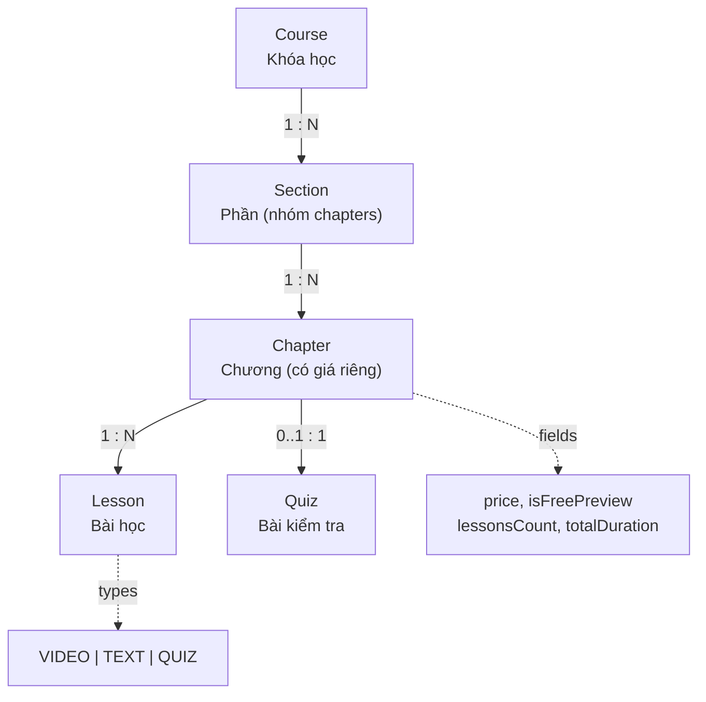

*Hình 4.1: Cấu trúc phân cấp của khóa học — Course → Section → Chapter → Lesson/Quiz*

Mỗi **Chapter** có thể:
- Có `price` riêng → hỗ trợ tính năng mua chapter đơn lẻ
- Đánh dấu `isFreePreview` → cho phép xem trước miễn phí
- Chứa nhiều **Lesson** (video, text) và 1 **Quiz** (optional)

### 4.4 Migration

Sau khi hoàn thành schema, chạy migration để tạo bảng trong PostgreSQL:

```bash
npx prisma migrate dev --name init
npx prisma generate
```

Migration tạo tất cả 61 bảng, enums, indexes, foreign keys trong **1 migration file** duy nhất (initial migration).

---

## 5. MODULE AUTH — XÁC THỰC VÀ PHÂN QUYỀN

### 5.1 Tổng quan

Module Auth là module quan trọng nhất, xử lý toàn bộ quy trình xác thực với chiến lược **JWT access token + refresh token rotation**.

**Bảng 5.1: Thành phần module Auth**

| File | Vai trò |
|------|---------|
| `auth.module.ts` | Đăng ký service, controller, JWT, Passport |
| `auth.controller.ts` | 9 endpoints — register, login, refresh, logout, verify email, forgot/reset password, OTT |
| `auth.service.ts` | Business logic — hash password, tạo token, gửi email |
| `strategies/jwt.strategy.ts` | Passport JWT strategy — extract + validate token |
| `dto/register.dto.ts` | Validate input đăng ký (email, password, fullName) |
| `dto/login.dto.ts` | Validate input đăng nhập |
| `dto/verify-email.dto.ts` | Validate token xác thực email |
| `dto/forgot-password.dto.ts` | Validate email quên mật khẩu |
| `dto/reset-password.dto.ts` | Validate token + mật khẩu mới |
| `dto/validate-ott.dto.ts` | Validate One-Time Token (cross-portal) |

### 5.2 Luồng đăng ký (Register)

<!-- ======================== HÌNH 4 ======================== -->

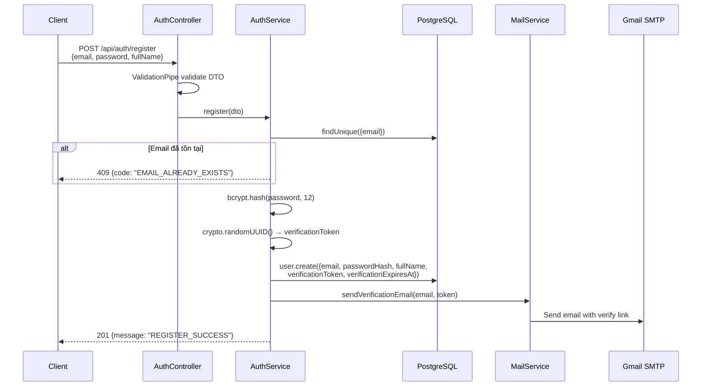

*Hình 5.1: Sequence diagram — Luồng đăng ký tài khoản*

Chi tiết xử lý:
- **Validate DTO**: `class-validator` tự động validate email format, password tối thiểu 8 ký tự, fullName không rỗng
- **Hash password**: Sử dụng `bcryptjs` với **12 salt rounds** (cân bằng giữa bảo mật và hiệu năng)
- **Verification token**: `crypto.randomUUID()` tạo UUID v4, hết hạn sau **24 giờ**
- **Trạng thái user**: Tạo với `status: UNVERIFIED`, chuyển sang `ACTIVE` khi verify thành công
- **Email verification**: Gửi email chứa link dạng `{STUDENT_PORTAL_URL}/verify-email?token={uuid}`
- **Error code, không message**: Trả `{ code: "EMAIL_ALREADY_EXISTS" }` — frontend sẽ map sang message đa ngôn ngữ

### 5.3 Luồng đăng nhập (Login) và JWT Token

<!-- ======================== HÌNH 5 ======================== -->

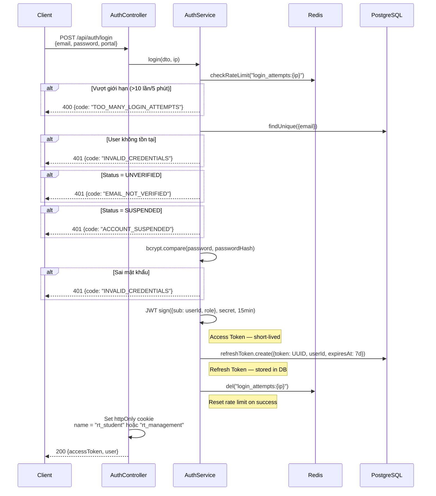

*Hình 5.2: Sequence diagram — Luồng đăng nhập với JWT và rate limiting*

**Bảng 5.2: So sánh Access Token và Refresh Token**

| | Access Token | Refresh Token |
|---|---|---|
| **Lưu trữ** | Memory (JavaScript variable) | httpOnly cookie |
| **Thời hạn** | 15 phút | 7 ngày |
| **Format** | JWT (signed) | UUID v4 (opaque) |
| **Truyền đi** | `Authorization: Bearer {token}` | Tự động gửi qua cookie |
| **Lưu DB** | Không | Có (bảng `refresh_tokens`) |
| **Khi hết hạn** | Gọi `/api/auth/refresh` | Phải đăng nhập lại |

**Cookie isolation giữa 2 portal:**

Hệ thống có 2 portal chạy trên 2 domain khác nhau (Student Portal và Management Portal). Để tránh xung đột cookie:
- Student Portal dùng cookie name: `rt_student`
- Management Portal dùng cookie name: `rt_management`
- Cookie `path` = `/api/auth` — chỉ gửi khi gọi auth endpoints
- Cookie `sameSite` = `lax`, `secure` = true ở production

### 5.4 Luồng Refresh Token Rotation

Khi access token hết hạn (15 phút), client tự động gọi refresh:

<!-- ======================== HÌNH 6 ======================== -->

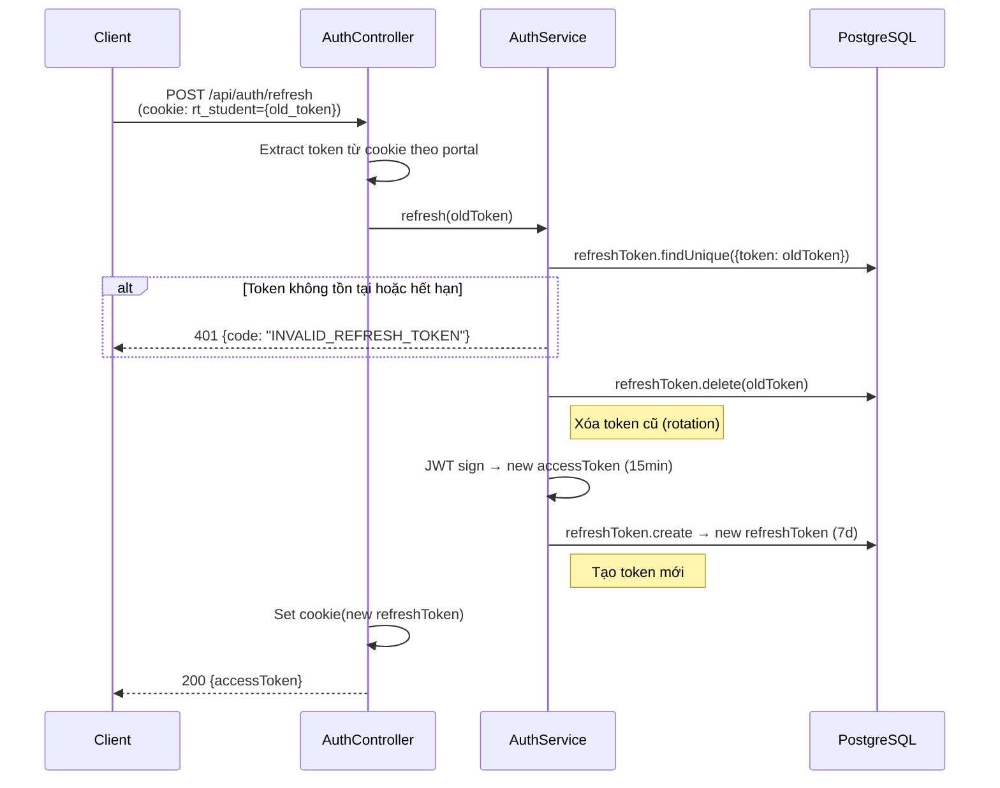

*Hình 5.3: Sequence diagram — Refresh Token Rotation*

**Token Rotation** đảm bảo mỗi refresh token chỉ dùng được **1 lần**:
- Mỗi lần refresh: **xóa token cũ**, **tạo token mới**
- Nếu kẻ tấn công đánh cắp refresh token và sử dụng → token đã bị xóa → fail
- Khi reset password: **xóa tất cả** refresh tokens của user → force logout mọi thiết bị

### 5.5 One-Time Token (OTT) — Chuyển portal

Khi user đã đăng nhập ở Student Portal và muốn chuyển sang Management Portal (hoặc ngược lại):

<!-- ======================== HÌNH 7 ======================== -->

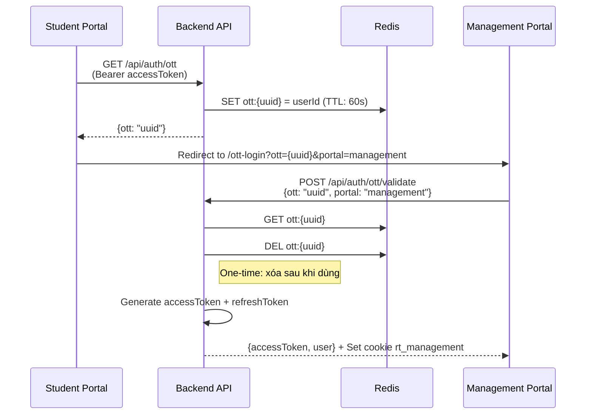

*Hình 5.4: Sequence diagram — Cross-portal authentication với OTT*

OTT được lưu trong **Redis** (không phải database) vì:
- Thời hạn rất ngắn (**60 giây**)
- Chỉ dùng 1 lần rồi xóa
- Không cần persist — nếu Redis restart, user chỉ cần tạo OTT mới

### 5.6 Tổng hợp API Endpoints — Module Auth

**Bảng 5.3: Danh sách endpoints module Auth**

| Method | Endpoint | Auth | Mô tả |
|--------|---------|------|--------|
| POST | `/api/auth/register` | Public | Đăng ký tài khoản |
| POST | `/api/auth/login` | Public | Đăng nhập, trả access token |
| POST | `/api/auth/refresh` | Public (cookie) | Refresh access token |
| POST | `/api/auth/logout` | Bearer | Logout, xóa refresh token |
| POST | `/api/auth/verify-email` | Public | Xác thực email bằng token |
| POST | `/api/auth/resend-verification` | Public | Gửi lại email xác thực |
| POST | `/api/auth/forgot-password` | Public | Gửi email reset password |
| POST | `/api/auth/reset-password` | Public | Đặt lại mật khẩu |
| GET | `/api/auth/ott` | Bearer | Tạo OTT cho cross-portal |
| POST | `/api/auth/ott/validate` | Public | Validate OTT và nhận tokens |

**Bảo mật chống email enumeration:**
- `POST /api/auth/forgot-password`: Luôn trả `{ message: "RESET_EMAIL_SENT" }` dù email tồn tại hay không
- `POST /api/auth/resend-verification`: Tương tự → kẻ tấn công không thể biết email nào đã đăng ký

---

## 6. MODULE USERS & INSTRUCTOR — QUẢN LÝ NGƯỜI DÙNG

### 6.1 Tổng quan

Module Users quản lý profile, follow system, và đổi mật khẩu. Module Instructor quản lý quy trình đăng ký làm giảng viên và profile giảng viên.

**Bảng 6.1: Thành phần module Users & Instructor**

| Module | File | Vai trò |
|--------|------|---------|
| Users | `users.controller.ts` | 8 endpoints — profile CRUD, follow, search |
| Users | `users.service.ts` | Business logic — profile, follow system |
| Instructor | `instructor.controller.ts` | 5 endpoints — application, profile, dashboard |
| Instructor | `instructor.service.ts` | Business logic — submit application, dashboard stats |

### 6.2 Profile System

<!-- ======================== HÌNH 8 ======================== -->

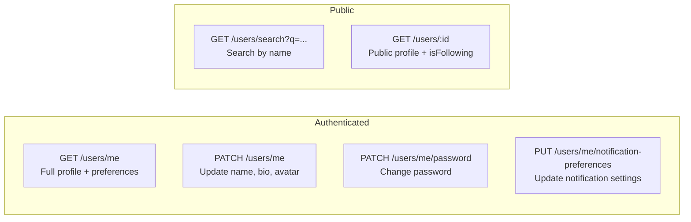

*Hình 6.1: User Profile endpoints — Public vs Authenticated*

Điểm đáng chú ý:
- **GET /users/me**: Trả đầy đủ thông tin (email, role, status, notificationPreferences, instructorProfile)
- **GET /users/:id** (public): Chỉ trả thông tin công khai (fullName, avatarUrl, bio, followerCount). Nếu người gọi đã login → thêm field `isFollowing: boolean`
- **Change password**: Validate mật khẩu hiện tại trước khi cho phép đổi
- **USER_SAFE_SELECT**: Constant định nghĩa các field an toàn để trả về, **không bao giờ** trả `passwordHash` hay `resetToken`

### 6.3 Follow System

Follow system sử dụng **Prisma transaction** để đảm bảo tính nhất quán:

<!-- ======================== HÌNH 9 ======================== -->

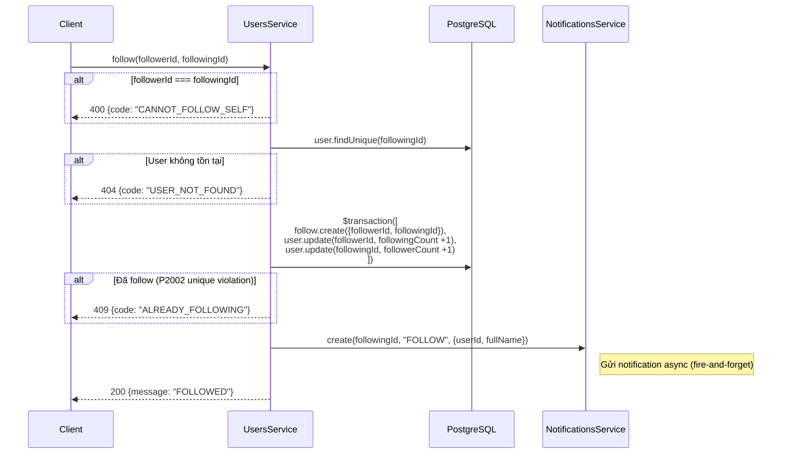

*Hình 6.2: Sequence diagram — Follow system với transaction và notification*

Giải thích quyết định kỹ thuật:
- **Transaction 3 operations**: Tạo Follow record + cập nhật `followingCount` và `followerCount` trong 1 transaction → nếu bất kỳ operation nào fail, tất cả rollback
- **Denormalized counters**: Thay vì `SELECT COUNT(*) FROM follows WHERE followingId = ?` mỗi lần load profile (tốn query), lưu trực tiếp `followerCount` trên User → đọc nhanh O(1)
- **P2002 handling**: Prisma trả error code P2002 khi vi phạm unique constraint → catch và trả 409 ALREADY_FOLLOWING
- **Notification fire-and-forget**: Gọi `.catch(() => {})` → không chặn response nếu notification fail

### 6.4 Instructor Application — Quy trình đăng ký giảng viên

<!-- ======================== HÌNH 10 ======================== -->

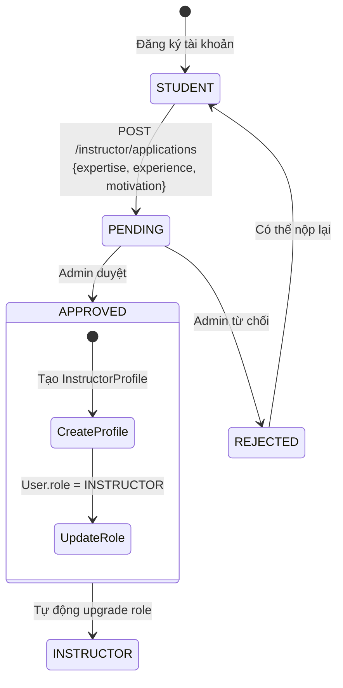

*Hình 6.3: State diagram — Quy trình Student → Instructor*

**Bảng 6.2: Endpoints module Instructor**

| Method | Endpoint | Auth | Mô tả |
|--------|---------|------|--------|
| POST | `/api/instructor/applications` | Student | Nộp đơn đăng ký |
| GET | `/api/instructor/applications/me` | Bearer | Xem trạng thái đơn |
| GET | `/api/instructor/profile` | Instructor | Xem profile giảng viên |
| PATCH | `/api/instructor/profile` | Instructor | Cập nhật headline, bio, expertise |
| GET | `/api/instructor/dashboard` | Instructor | Dashboard — doanh thu, học viên, enrollments |

---

## 7. MODULE COURSES & CATEGORIES — KHÓA HỌC

### 7.1 Tổng quan

Module Courses là module lớn nhất, chia thành **5 sub-modules** theo trách nhiệm:

**Bảng 7.1: Cấu trúc module Courses**

| Sub-module | Thư mục | Vai trò |
|-----------|---------|---------|
| **Browse** | `courses/browse/` | Public endpoints — tìm kiếm, filter, xem chi tiết khóa học |
| **Management** | `courses/management/` | Instructor endpoints — CRUD khóa học, submit duyệt |
| **Sections** | `courses/sections/` | CRUD sections (phần) trong khóa học |
| **Chapters** | `courses/chapters/` | CRUD chapters (chương) trong section |
| **Lessons** | `courses/lessons/` | CRUD lessons (bài học) trong chapter |
| **Quizzes** | `courses/quizzes/` | CRUD quizzes + quiz questions + options |
| **Reviews** | `courses/reviews/` | Đánh giá khóa học (chỉ enrolled students) |

### 7.2 Browse Courses — Tìm kiếm và filter

<!-- ======================== HÌNH 11 ======================== -->

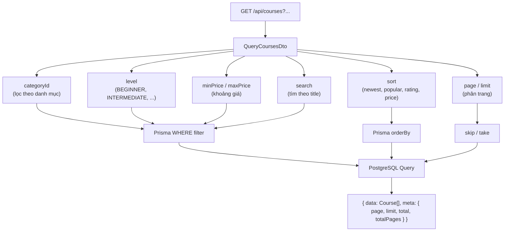

*Hình 7.1: Luồng browse courses với filters và phân trang*

Query `GET /api/courses` chỉ trả **published courses** (`status: PUBLISHED`, `deletedAt: null`) với các field cần thiết cho listing:

```typescript
select: {
  id, title, slug, shortDescription, thumbnailUrl,
  level, language, price, originalPrice,
  avgRating, reviewCount, totalStudents, totalLessons, totalDuration,
  instructor: { select: { id, fullName, avatarUrl } },
  category: { select: { id, name, slug } },
  courseTags: { include: { tag: { select: { id, name } } } },
}
```

Kết quả trả về theo format phân trang chuẩn:
```json
{
  "data": [...],
  "meta": { "page": 1, "limit": 12, "total": 156, "totalPages": 13 }
}
```

### 7.3 Course Detail — Xem chi tiết khóa học

`GET /api/courses/:slug` trả đầy đủ thông tin khóa học bao gồm curriculum:

**Bảng 7.2: Dữ liệu trả về khi xem chi tiết khóa học**

| Nhóm | Fields | Ghi chú |
|------|--------|---------|
| Thông tin chung | title, description, thumbnailUrl, level, language, price | |
| Learning outcomes | learningOutcomes (JSON array) | Mục tiêu học |
| Prerequisites | prerequisites (JSON array) | Yêu cầu trước khi học |
| Instructor | fullName, avatarUrl, headline, biography | InstructorProfile |
| Thống kê | avgRating, reviewCount, totalStudents, totalLessons, totalDuration | Denormalized counters |
| Curriculum | sections → chapters → lessons (title, type, duration) | Chỉ title + metadata, không có content |
| Quizzes | quiz → questionsCount | Chỉ count, không có đáp án |
| Tags | courseTags → tag (name) | |
| Enrollment status | isEnrolled, enrollmentType | Chỉ khi user đã login |

Khi user đã login (`@Public()` vẫn extract JWT nếu có), hệ thống kiểm tra enrollment status:
- `isEnrolled: true` → hiện nút "Tiếp tục học"
- `enrollmentType: "FULL"` hoặc `"PARTIAL"` → xác định quyền truy cập
- `isEnrolled: false` → hiện nút "Thêm vào giỏ hàng"

### 7.4 Course Management — Instructor CRUD

Instructor quản lý khóa học qua các endpoint có **RolesGuard** giới hạn role INSTRUCTOR:

<!-- ======================== HÌNH 12 ======================== -->

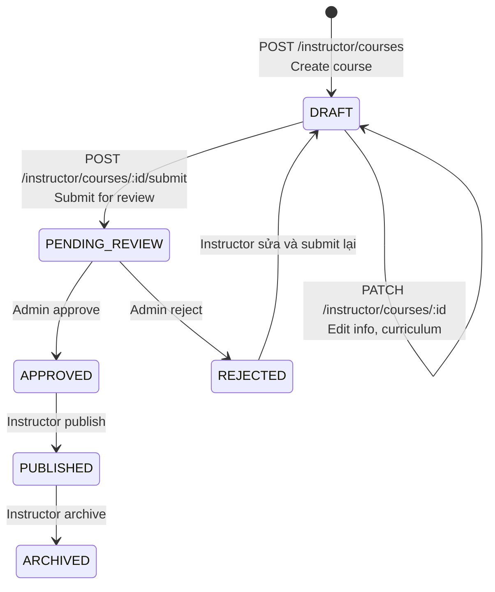

*Hình 7.2: State diagram — Vòng đời khóa học (Course lifecycle)*

**Bảng 7.3: Endpoints module Course Management**

| Method | Endpoint | Mô tả |
|--------|---------|--------|
| GET | `/api/instructor/courses` | Danh sách khóa học của instructor (mọi status) |
| GET | `/api/instructor/courses/:id` | Chi tiết khóa học (bao gồm draft) |
| POST | `/api/instructor/courses` | Tạo khóa học mới (status: DRAFT) |
| PATCH | `/api/instructor/courses/:id` | Cập nhật thông tin khóa học |
| DELETE | `/api/instructor/courses/:id` | Soft delete (đặt deletedAt) |
| POST | `/api/instructor/courses/:id/submit` | Submit cho admin review |
| PUT | `/api/instructor/courses/:id/tags` | Cập nhật tags của khóa học |
| GET | `/api/instructor/courses/:id/students` | Danh sách học viên enrolled |

Mọi operation đều kiểm tra **ownership**: `where: { id, instructorId: user.sub }` → instructor chỉ quản lý khóa học của chính mình.

### 7.5 Curriculum CRUD — Sections, Chapters, Lessons, Quizzes

Instructor xây dựng curriculum với 4 cấp:

**Bảng 7.4: CRUD endpoints cho Curriculum**

| Resource | Create | Read | Update | Delete | Reorder |
|----------|--------|------|--------|--------|---------|
| Section | POST `/courses/:id/sections` | (included in course detail) | PATCH `/sections/:id` | DELETE `/sections/:id` | PUT `/courses/:id/sections/reorder` |
| Chapter | POST `/sections/:id/chapters` | (included in section) | PATCH `/chapters/:id` | DELETE `/chapters/:id` | PUT `/sections/:id/chapters/reorder` |
| Lesson | POST `/chapters/:id/lessons` | (included in chapter) | PATCH `/lessons/:id` | DELETE `/lessons/:id` | PUT `/chapters/:id/lessons/reorder` |
| Quiz | POST `/chapters/:id/quiz` | (included in chapter) | PATCH `/quizzes/:id` | DELETE `/quizzes/:id` | — |

Tính năng **reorder** cho phép Instructor kéo thả sắp xếp thứ tự sections, chapters, lessons. Backend nhận mảng `[{id, order}]` và update trong transaction:

```typescript
// Reorder sections
async reorder(courseId: string, instructorId: string, items: ReorderDto[]) {
  await this.prisma.$transaction(
    items.map(item =>
      this.prisma.section.update({
        where: { id: item.id, course: { id: courseId, instructorId } },
        data: { order: item.order },
      })
    )
  );
}
```

### 7.6 Reviews — Đánh giá khóa học

Chỉ student đã enrolled mới được đánh giá, mỗi student chỉ 1 review per course:

**Bảng 7.5: Endpoints module Reviews**

| Method | Endpoint | Auth | Mô tả |
|--------|---------|------|--------|
| GET | `/api/courses/:slug/reviews` | Public | Danh sách reviews (phân trang, filter rating) |
| POST | `/api/courses/:id/reviews` | Bearer (enrolled) | Tạo review (rating 1-5 + comment) |
| PATCH | `/api/reviews/:id` | Bearer (owner) | Sửa review |
| DELETE | `/api/reviews/:id` | Bearer (owner) | Xóa review |

Khi tạo/sửa/xóa review, hệ thống tự động **recalculate** `avgRating` và `reviewCount` trên Course.

### 7.7 Categories — Danh mục khóa học

Module Categories đơn giản với 2 public endpoints:

| Method | Endpoint | Mô tả |
|--------|---------|--------|
| GET | `/api/categories` | Danh sách categories (tree structure parent → children) |
| GET | `/api/categories/:slug` | Chi tiết category |

Categories hỗ trợ **2 cấp phân cấp** (parent → children) qua self-relation `parentId`.

---

## 8. KIỂM THỬ

Em viết **unit tests** cho các module đã triển khai, sử dụng **Jest** + mock Prisma/Redis:

**Bảng 8.1: Thống kê kiểm thử module Auth, Users, Courses, Categories**

| Module | File test | Số test cases | Các luồng kiểm tra |
|--------|----------|--------------|-------------------|
| Auth Service | `auth.service.spec.ts` | ~20 | Register (success, duplicate email), Login (success, wrong password, unverified, suspended, rate limit), Refresh (success, expired, invalid), Verify email, Forgot/Reset password, OTT |
| Auth Controller | `auth.controller.spec.ts` | ~12 | Request/response mapping, cookie handling |
| Auth DTOs | `dto.validation.spec.ts` | ~10 | Email format, password length, required fields |
| Users Service | `users.service.spec.ts` | ~15 | GetMe, updateProfile, follow/unfollow (transaction, self-follow, already following), getFollowers/getFollowing |
| Instructor Service | `instructor.service.spec.ts` | ~10 | Submit application, duplicate application, getProfile, dashboard stats |
| Courses Browse | `courses.service.spec.ts` | ~12 | FindAll with filters, findBySlug (enrolled/not enrolled), pagination |
| Course Management | `course-management.service.spec.ts` | ~15 | Create, update, delete (soft), submit for review, ownership check |
| Sections | `sections.service.spec.ts` | ~8 | CRUD, reorder, cascade behavior |
| Chapters | `chapters.service.spec.ts` | ~8 | CRUD, reorder, counter update |
| Lessons | `lessons.service.spec.ts` | ~8 | CRUD, reorder, duration update |
| Quizzes | `quizzes.service.spec.ts` | ~8 | CRUD quiz + questions + options |
| Reviews | `reviews.service.spec.ts` | ~10 | Create (enrolled check, duplicate), update, delete, recalculate rating |
| Categories | `categories.service.spec.ts` | ~5 | FindAll (tree), findBySlug |

Phương pháp kiểm thử:
- **Mock**: Prisma Service, Redis Service, Mail Service được mock hoàn toàn
- **Pattern**: Arrange → Act → Assert
- **Coverage**: Kiểm tra cả happy path và error cases (exceptions, edge cases)

---

## 9. KẾ HOẠCH TUẦN TIẾP THEO

- Triển khai các module backend còn lại: Ecommerce (Cart, Orders, Coupons, Enrollments), Learning (Progress, Quiz, Certificates), Social (Posts, Comments, Feed, Follow)
- Triển khai module Chat (WebSocket), Q&A (Questions, Answers, Votes), Notifications
- Triển khai module AI Tutor (RAG pipeline, Groq API), Recommendations, Admin, Reports
- Viết unit tests cho tất cả module mới
- Chuẩn bị nền tảng frontend (shared packages, API client)

---

<!-- KẾT THÚC NỘI DUNG BÁO CÁO -->
